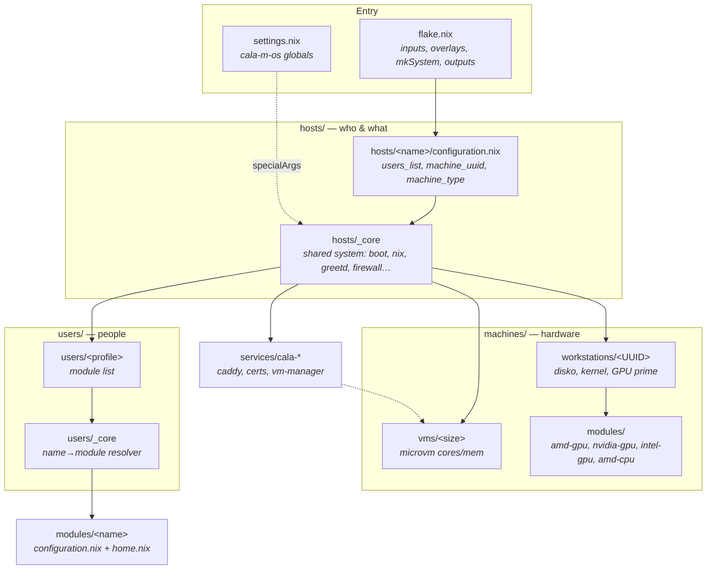
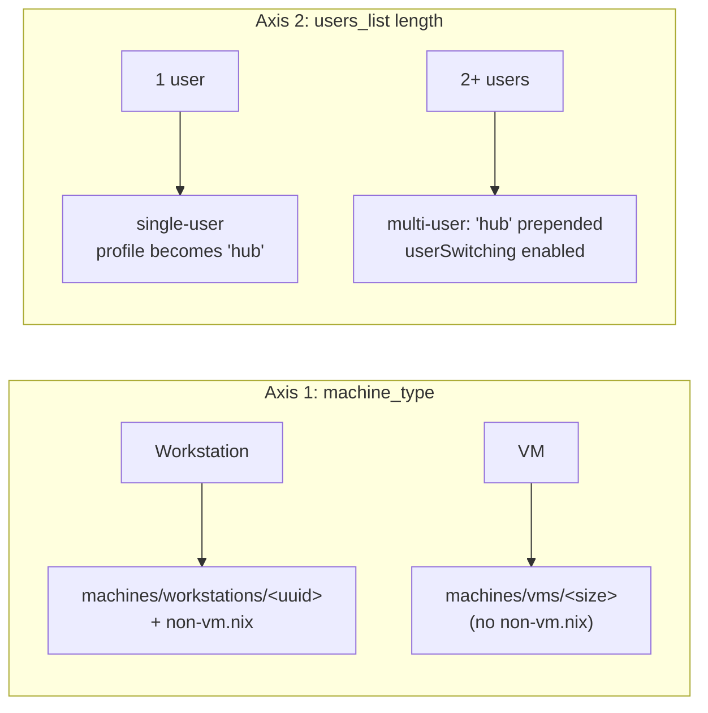

# Architecture Overview

Cala-M-OS is one flake that produces many machines. Configuration flows **top-down** through a handful of clearly separated layers, each with exactly one job. This page is the map; the per-layer pages drill in.

---

## The layers at a glance



---

## Folder reference

| Folder | Role | Page |
|--------|------|------|
| `flake.nix` | Entry point: inputs, overlays, `mkSystem`, all outputs (hosts + ISO + dev shell + templates) | [[Flake & Inputs|Flake-and-Inputs]] |
| `settings.nix` | Global constants injected everywhere as `cala-m-os` via `specialArgs` | [[Global Settings|Global-Settings]] |
| `hosts/` | The configurable machines. Pick users + machine identity; inherit `_core`. Hardware-agnostic (except VM hosts passing devices through). | [[Hosts|Hosts]] |
| `hosts/_core/` | The shared system every host expands into | [[Configuration Hierarchy|Configuration-Hierarchy]] |
| `machines/workstations/<UUID>/` | Physical hardware: `hardware-configuration.nix`, `disko.nix`, GPU/CPU enablement, per-machine module overrides | [[Machines|Machines]] |
| `machines/vms/<size>/` | MicroVM resource presets (X-Small → Large) | [[Machines|Machines]] |
| `machines/modules/` | Hardware-enablement modules (GPU/CPU), imported by workstation configs | [[Machines|Machines]] |
| `modules/<name>/` | Programs + their settings (system + home). ~89 modules. | [[Modules|Modules]] |
| `services/` | Idiomatic NixOS service modules: `cala-caddy`, `cala-certs`, `cala-vm-manager` | [[Services|Services]] |
| `users/<profile>/` | Per-user module selections and settings | [[Users & Profiles|Users-and-Profiles]] |
| `iso/` | Custom installer image + minimal first-pass config | [[ISO & Installer|ISO-Installer]] |
| `templates/` | `nix flake init` scaffolds: host / module / user / secret | [[Common Tasks|Common-Tasks]] |
| `overlays/` | nixpkgs overlays (currently an empty placeholder, `[]`) | [[Flake & Inputs|Flake-and-Inputs]] |
| `prefetch/` | Vendored blobs that can't be fetched automatically (e.g. DisplayLink driver) | [[ISO & Installer|ISO-Installer]] |
| `assets/` | Branding/logos for the README | — |

---

## Two orthogonal axes

Two independent decisions shape what a host becomes. Keeping them separate is key to understanding the codebase.



- **`machine_type`** (`Workstation` | `VM`) selects the hardware source and whether workstation-only settings (`non-vm.nix`: unfree, store auto-optimise, `/etc/nixos` permissions, NetworkManager) apply.
- **`users_list` length** decides single- vs multi-user. With 2+ users, the `hub` switcher profile is auto-prepended and the [[persona switching system|User-Switching]] turns on.

> All nine flake-wired hosts are currently **single-user**. The multi-user machinery is fully implemented and ready, but no wired host triggers it today (the unwired `lanstation-multi` is the multi-NIC VM-host variant). See [[Hosts|Hosts]].

---

## How a build actually runs

```mermaid
sequenceDiagram
  participant CLI as nixos-rebuild
  participant Flake as flake.nix
  participant Host as hosts/&lt;name&gt;
  participant Core as _core
  participant HW as machines/&lt;uuid&gt;
  participant U as users/&lt;profile&gt;

  CLI->>Flake: build .#&lt;name&gt;
  Flake->>Flake: read settings.nix → cala-m-os
  Flake->>Flake: read INITIAL_INSTALL_MODE env
  Flake->>Host: load configuration.nix (+ specialArgs)
  Host->>Core: import _core/default.nix {users_list, machine_*}
  alt INITIAL_INSTALL_MODE=1
    Core->>Core: import iso/minimal-config (bare, bootable)
  else normal rebuild
    Core->>Core: import _core/configuration.nix (full)
    Core->>HW: import machines/&lt;type&gt;/&lt;uuid&gt;
    Core->>U: resolve profiles → modules → imports
  end
  Core-->>CLI: complete system derivation
```

The single switch that picks the minimal-vs-full path is **`INITIAL_INSTALL_MODE`** — see [[ISO & Installer|ISO-Installer]] and [[Configuration Hierarchy|Configuration-Hierarchy]].

---

## Design principles you'll see repeated

1. **Hosts carry no hardware knowledge.** They name a `machine_uuid`; the machine layer owns disks, kernel, GPU bus IDs.
2. **Reusable modules stay hardware-agnostic.** Hardware specifics (PRIME bus IDs, monitor names) are pushed *down* into per-machine overrides.
3. **Strict two-file convention.** Every module ships both `configuration.nix` (system) and `home.nix` (home-manager) — even if one is an empty stub. The core auto-discovers which half exists.
4. **Profiles ≠ usernames.** A user profile is a directory; the primary profile is mapped to the username `hub`. See [[Users & Profiles|Users-and-Profiles]].
5. **One root of trust.** Hardware Yubikeys back secret encryption, SSH, and GPG. See [[Secrets & Security|Secrets-and-Security]].
6. **Declarative everything.** Disks (disko), secrets (agenix), VMs (microvm.nix), theming (stylix), home (home-manager) are all expressed in Nix.
