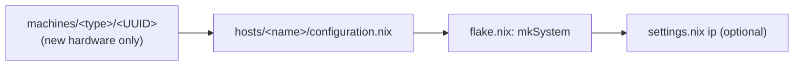

# Common Tasks (Cookbook)

Practical recipes. See the linked pages for the underlying mechanics.

---

## Rebuild & switch

```bash
sudo nixos-rebuild switch --flake .#<hostname>          # apply now
sudo nixos-rebuild switch --flake .#<hostname> --show-trace   # debug eval errors
sudo nixos-rebuild boot   --flake .#<hostname>          # apply on next boot
```

Convenience module `rebuild-config` wraps this: it stages via `lazygit` if the tree is dirty, then runs `nh os switch /etc/nixos`.

> On workstations any `wheel` user can edit `/etc/nixos` in place — `non-vm.nix` chowns it `hub:wheel` and sets `775`/`664` on every activation. See [[Configuration Hierarchy|Configuration-Hierarchy]].

---

## Format & check

```bash
alejandra .            # format all Nix files (== nix fmt)
nix flake check        # evaluate all configs
nix develop            # dev shell: alejandra, nixd, nil, claude-code, flash-iso, zed
```

---

## Build & flash the installer ISO

```bash
nix build .#nixosConfigurations.iso.config.system.build.isoImage   # == nix build .#default
nix develop -c flash-iso                                           # build + flash to USB (interactive)
```

See [[ISO & Installer|ISO-Installer]].

---

## Install on new hardware

From the booted ISO:

```bash
sudo install-cala-m-os <hostname>
```

Two-pass: minimal (`INITIAL_INSTALL_MODE=1`) → full rebuild → set passwords → reboot. Then restore Yubikey GPG/SSH keys ([[ISO & Installer|ISO-Installer]]).

### Install a host onto different hardware

```bash
sudo install-cala-m-os devbox MS-01     # build the devbox host onto an MS-01 box
```

The optional 2nd arg overrides the host's default machine (auto-detects Workstation vs VM). It's used live for disko + both install passes, then persisted to `machine-override.nix` so future rebuilds on the box keep it. To override an already-installed box without reinstalling, edit `machine-override.nix` (`{ devbox = "MS-01"; }`) and rebuild. See [[ISO & Installer|ISO-Installer]].

---

## Add a host



1. (New hardware) create `machines/workstations/<UUID>/` with `configuration.nix`, `disko.nix`, `hardware-configuration.nix`, `home.nix`. See [[Machines|Machines]].
2. `nix flake init -t .#host` → `hosts/<name>/configuration.nix`; set `users_list`, `machine_type`, `machine_uuid`, `networking.hostName`.
3. In `flake.nix` add `<name> = mkSystem "<name>" {};`.
4. (Optional) add `ip.<name>` in `settings.nix`.

Details: [[Hosts|Hosts]].

---

## Add a module

1. `nix flake init -t .#module` → `modules/<name>/{configuration,home}.nix` (keep both; one may be an empty `{...}: {}`).
2. Put system config in `configuration.nix`, user/home config in `home.nix`.
3. Add `"<name>"` to the `modules` list in the relevant `users/<profile>/default.nix`.
4. Rebuild.

Details: [[Modules|Modules]].

---

## Add a user / profile

1. `nix flake init -t .#user` → `users/<name>/default.nix`.
2. Set its `modules` list (bare module-name strings).
3. Add groups/mounts in `users/<name>/configuration.nix`; home overrides in `home.nix`.
4. Add `<name>` to a host's `users_list`. **A second entry enables [[persona switching|User-Switching]].**
5. Rebuild.

Details: [[Users & Profiles|Users-and-Profiles]].

---

## Add a secret

```bash
nix flake init -t .#secret              # scaffolds secrets/{secrets.nix,default.nix}
agenix -e <name>.age -i ./identities/yubi.key   # run from the bundle dir
```

1. List the recipients in the bundle's `secrets.nix` (nano + backup always; dev/server as needed).
2. Register it in the bundle's `default.nix` (`age.secrets.<name> = …`), gated by `calamoose.enableSecrets`.
3. Consume via `config.age.secrets.<name>.path`.

Details: [[Secrets & Security|Secrets-and-Security]].

---

## Add a MicroVM guest

1. Create `hosts/<guest>/configuration.nix` with `machine_type = "VM"` and a size `machine_uuid` (`X-Small`…`Large`).
2. Add an entry to the VM host's `vms` set in `hosts/<vmhost>/vms.nix` (`storage`, optional `devices`, `ipOverride`, `shares`…).
3. For passthrough, add `devices/<dev>/{host.nix,guest.nix}` and list `<dev>` in the guest's `devices`.
4. Rebuild the **host** (`nixos-rebuild switch --flake .#<vmhost>`).

Details: [[MicroVMs|MicroVMs]].

---

## Enable / disable secrets on a host

```nix
# in hosts/<name>/configuration.nix
calamoose.enableSecrets = false;   # build without Yubikey-decryptable secrets
```

Default is `true`. Currently `false` on `broadcast`, `openreturn`, `quorumcall`, `livedata`.

---

## Troubleshooting

| Symptom | Likely cause |
|---------|--------------|
| `getEnv`/impure eval error during install | Missing `--impure` (needed because the flake reads `INITIAL_INSTALL_MODE`) |
| Eval fails on a VM host referencing a device | A `devices/<dev>/` dir is missing for a name in some guest's `devices` (`host-imports.nix`/guest import resolves the path) |
| Secret path is null | `calamoose.enableSecrets = false` on that host, or the secret isn't registered in a bundle `default.nix` |
| `non-vm.nix` applied to a VM | `machine_type` typed lowercase `"vm"` — use `"VM"` exactly (the guard is case-sensitive) |
| Persona indicator missing in waybar | Host is single-user, so `userSwitching.enable` is false (expected) |
