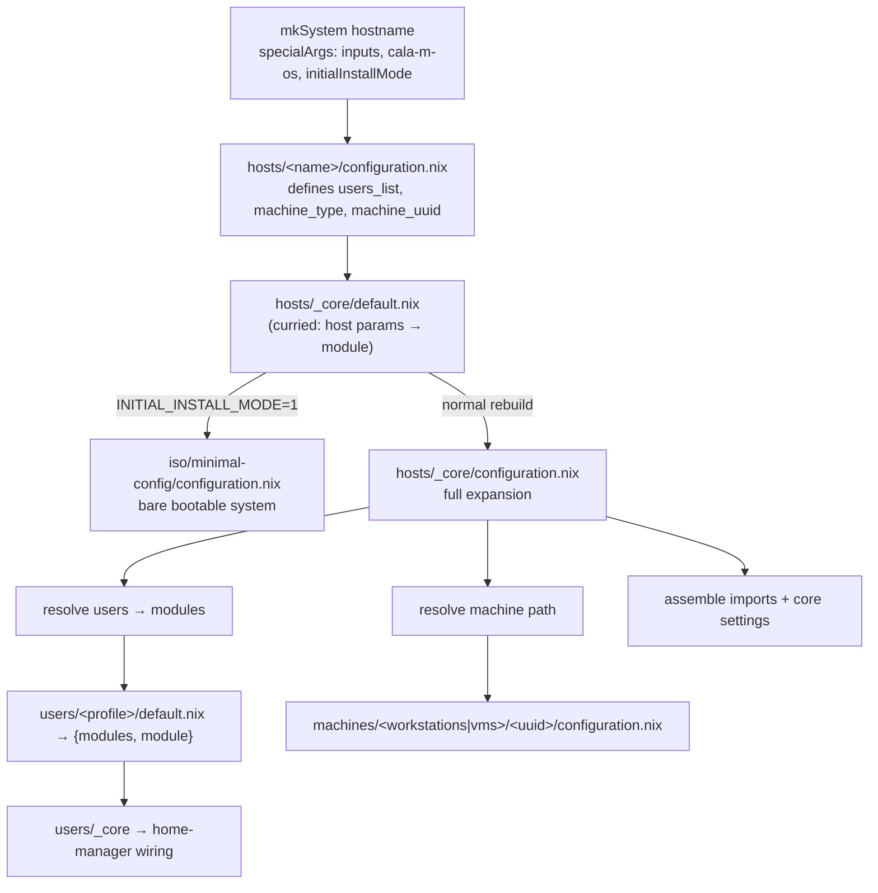
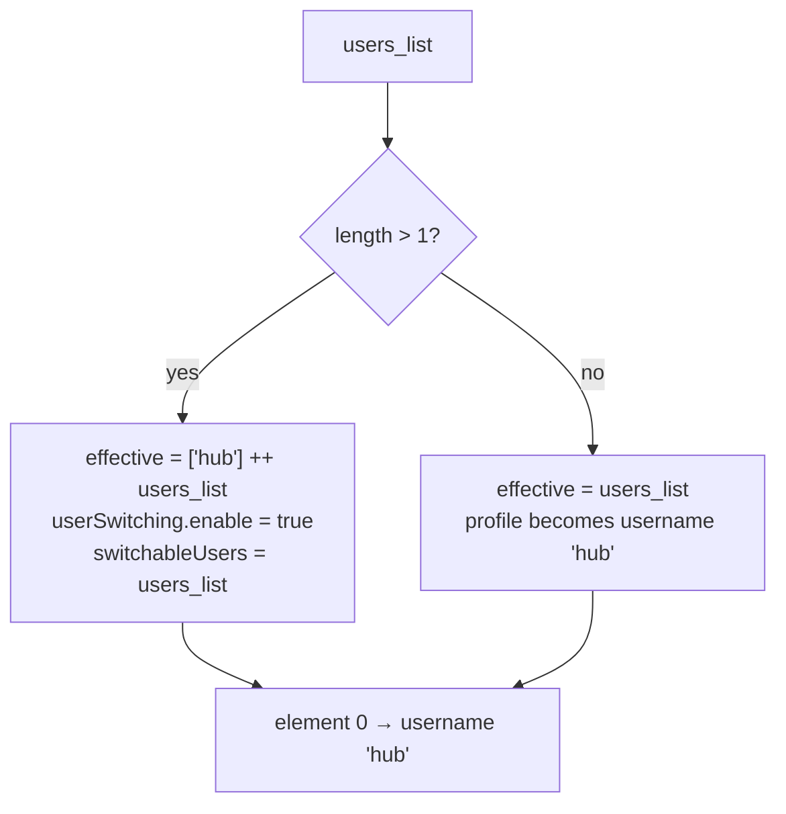

# Configuration Hierarchy

This is the heart of the repo: the exact control flow by which a hostname expands into a full NixOS system. Everything common lives in `hosts/_core`.

---

## The expansion pipeline



---

## Stage 1 — the host file

A host file is small. It declares identity and imports `_core`:

```nix
{cala-m-os, ...}: let
  import_users = ["debugger"];
  machine_type = "Workstation";
  machine_uuid = "FW16-AMD-AI";
in {
  imports = [
    (import ../_core/default.nix {
      users_list = import_users;
      machine_type = machine_type;
      machine_uuid = machine_uuid;
      extra_user_modules = {};
    })
  ];
  networking.hostName = "devbox";
  # …host-specific extras (printing, audio, static IPs, etc.)
}
```

| Parameter | Meaning |
|-----------|---------|
| `users_list` | List of **profile** names (e.g. `["debugger"]`, `["gamer"]`) |
| `machine_type` | `"Workstation"` or `"VM"` |
| `machine_uuid` | Hardware directory name under `machines/<type>/` |
| `extra_user_modules` | Optional `{ profile = [moduleNames]; }` for per-host augmentation (all hosts pass `{}` today) |

---

## Stage 2 — `_core/default.nix` (the install-mode switch)

`_core/default.nix` is a **curried two-stage module**. The host applies stage one with params; the returned value is a module that reads `initialInstallMode` from `specialArgs`:

```nix
{users_list, machine_type, machine_uuid, extra_user_modules ? {}, ...}:
{initialInstallMode, ...}: {
  imports =
    if initialInstallMode
    then [ (import ../../iso/minimal-config/configuration.nix {
             inherit machine_type machine_uuid; }) ]
    else [ (import ./configuration.nix {
             inherit users_list machine_type machine_uuid extra_user_modules; }) ];
}
```

- **Install mode** (`INITIAL_INSTALL_MODE=1`): import only the minimal ISO config — disko + bootable base, no users/secrets/VMs. `users_list`/`extra_user_modules` are intentionally dropped.
- **Normal**: import the full `_core/configuration.nix`.

> `hosts/simple` imports `_core/configuration.nix` **directly**, skipping this switch.

---

## Stage 3 — `_core/configuration.nix` (full expansion)

This is also curried: `{build params}: {inputs, lib, cala-m-os, pkgs}: {...}`. It performs four jobs.

### 3a. Single- vs multi-user detection

```nix
isMultiUser = builtins.length users_list > 1;
effectiveUsersList =
  if isMultiUser then ["hub"] ++ users_list else users_list;
defaultUser = lib.elemAt effectiveUsersList 0;
```

- **2+ users** → prepend the `hub` profile as element 0 (the switcher); listed users become additional named accounts.
- **1 user** → that profile is used as-is and becomes the default user.

The **default user** (element 0) maps to the system username `hub` (`cala-m-os.globals.defaultUser`); all other profiles use their directory name as username.



### 3b. Resolve users → modules

```nix
userDefs   = map getUserDef effectiveUsersList;     # imports users/<p>/default.nix
user_imports = map (d: d.module) userDefs;          # per-user home-manager wiring
allModuleNames = lib.unique (lib.concatLists (map (d: d.modules) userDefs));
system_config_imports =
  map (name: import (modulesPath + "/${name}/configuration.nix")) allModuleNames;
```

Each `users/<profile>/default.nix` returns `{ modules; module; }`:
- `modules` — flat list of module-name strings.
- `module` — the home-manager wiring (imports `users/_core`).

So the **system half** of every referenced module (`modules/<name>/configuration.nix`) is imported here, deduplicated with `lib.unique`. The **home half** is resolved one level down in `users/_core` (see [[Users & Profiles|Users-and-Profiles]]).

`extra_user_modules` is folded in similarly, with `lib.subtractLists` ensuring a module isn't imported twice, and `home.nix` guarded by `builtins.pathExists`.

### 3c. Resolve the machine path

```nix
isVM = machine_type == "VM" || machine_type == "vm";
machine_root = ../../machines + (if isVM then "/vms" else "/workstations");
machine_path = toString (machine_root + "/${machine_uuid}");
machine_configuration = import (machine_path + "/configuration.nix");
```

`machine_path/home.nix` is also threaded into home-manager as a shared module (see `_core/home.nix` below).

### 3d. Assemble imports + core settings

```nix
imports =
  [ ./options.nix
    inputs.disko.nixosModules.disko
    inputs.stylix.nixosModules.stylix
    (import ./home.nix { inherit machine_path; })
    machine_configuration
    ../../modules/user-switching/configuration.nix ]
  ++ user_imports
  ++ system_config_imports
  ++ extra_system_config_imports
  ++ lib.optional (machine_type != "VM") ./non-vm.nix;
```

Then the shared system settings (see table). Finally, for multi-user hosts only:

```nix
// lib.optionalAttrs isMultiUser {
  userSwitching.enable = true;
  userSwitching.switchableUsers = users_list;   # the personas, hub excluded
}
```

---

## What `_core/configuration.nix` actually sets

| Area | Setting |
|------|---------|
| **Boot** | `systemd-boot`, EFI vars on, `loader.timeout = 0`, Plymouth splash, quiet kernel params, `/tmp` on tmpfs, silent console |
| **Docs** | `documentation.enable = mkDefault false` ("we google everything") |
| **Firewall** | `networking.firewall.enable = true` |
| **Timezone** | `time.timeZone = cala-m-os.globals.TZ` → `America/Denver` |
| **Nix** | daily GC keeping 3 days; `nix-command` + `flakes`; trusted-users = root, `@wheel`, `hub` |
| **Login** | `greetd` enabled; default session user forced to `hub`; default command `bash` (overridable to launch Hyprland) |
| **Security** | `polkit.enable = true` |
| **State** | `system.stateVersion = "24.11"` |

---

## `_core/home.nix` — home-manager bootstrap

```nix
{machine_path, ...}: {inputs, cala-m-os, ...}: {
  imports = [ inputs.home-manager.nixosModules.default ];
  home-manager = {
    extraSpecialArgs = { inherit inputs cala-m-os; };
    backupFileExtension = "hm-backup";
    useGlobalPkgs = true;
    useUserPackages = true;
    sharedModules = [
      { programs.home-manager.enable = true; home.stateVersion = "24.11"; }
      (machine_path + "/home.nix")          # per-machine home (monitors, scaling)
    ];
  };
}
```

- Forwards `inputs` + `cala-m-os` into every home module.
- `useGlobalPkgs`/`useUserPackages` — home-manager shares the system nixpkgs.
- The per-machine `home.nix` is applied to **every** user (hardware-aware home config).

---

## `_core/non-vm.nix` — workstation-only

Imported for everything except `machine_type == "VM"`:

```nix
nixpkgs.config.allowUnfree = true;
nixpkgs.hostPlatform.system = "x86_64-linux";
nix.settings.auto-optimise-store = true;          # overrides core mkDefault false
system.activationScripts.setPermissions = ''       # any wheel user can edit /etc/nixos
  chown -R hub:wheel /etc/nixos
  find /etc/nixos -type d -exec chmod 775 {} +
  find /etc/nixos -type f -exec chmod 664 {} +
'';
networking.networkmanager.enable = lib.mkDefault true;
```

VMs skip all of this.

> **Subtlety:** the VM machine-path check (`isVM`) is case-tolerant (`"VM"`/`"vm"`), but the `non-vm.nix` guard is a strict `machine_type != "VM"`. A host typed lowercase `"vm"` would resolve VM hardware paths yet *still* get `non-vm.nix`. Always use `"VM"`.

---

## `_core/options.nix` — custom options

```nix
options.calamoose.enableSecrets = lib.mkOption {
  type = lib.types.bool; default = true;
  description = "Whether to load agenix secrets on this host.";
};
```

The single custom option in the core. Gates all agenix secret loading. See [[Secrets & Security|Secrets-and-Security]].

---

## End-to-end summary

For a normal rebuild of host `H`:

1. `flake.nix` → `mkSystem "H"` injects `inputs`, `cala-m-os`, `initialInstallMode`; loads `hosts/H/configuration.nix`.
2. The host declares `users_list` / `machine_type` / `machine_uuid` and imports `_core/default.nix`.
3. `_core/default.nix` picks minimal (install) or full config.
4. `_core/configuration.nix`: detect single/multi-user → resolve profiles to module imports → resolve machine hardware → assemble all imports → apply core settings → (multi-user) enable `userSwitching`.
5. `_core/home.nix` wires home-manager; each `home-manager.users.<username>` is built from the user's profile modules.
