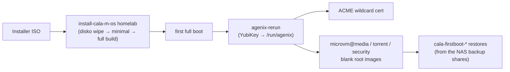

# Disaster Recovery — `homelab`

How to bring the `homelab` host (Minisforum MS-02) and its three MicroVM guests — `media` (Plex), `torrent` (Radarr / Sonarr / Prowlarr / qBittorrent over WireGuard) and `security` (UniFi Protect camera wall) — back from nothing but the git repo, a YubiKey and the backups on the NAS.



---

## What lives where

| Thing | Where it comes from on a rebuild | Backed up by |
|-------|----------------------------------|--------------|
| Host OS, host config | `github:CalamooseLabs/cala-m-os` master (the ISO clones it) | git |
| Secrets (Cloudflare token, WireGuard conf, qBit password hash, Protect API key + admin password, `admin_password`) | the `.age` files in the repo, decrypted on the host by a recipient YubiKey (`yubiserver` is the one that lives in the MS-02) | git + the four YubiKeys (`modules/agenix/identities/`) |
| TLS wildcard cert | re-issued by ACME (Cloudflare DNS-01) on first boot | nothing — regenerated |
| Guest root images (`/var/lib/microvms/<name>/<name>-vm.img`) | recreated **blank** by microvm.nix on first boot | nothing — regenerated, then restored from the NAS |
| Plex `Preferences.xml` (server identity + claim) and the two library databases | `/mnt/backup` (NAS `Backups/Plex`) via `plex-restore` | `plex-backup.timer` (daily, keeps 7 snapshots) |
| Radarr / Sonarr / Prowlarr DB + `config.xml` (API keys) | `/mnt/backups/<app>` via `<app>-restore` | each app's own scheduled backup (Settings → General → Backups) |
| qBittorrent torrents (`.torrent` + `.fastresume`), categories/tags, RSS | `/mnt/backups/qbittorrent` via `qbittorrent-restore` | `qbittorrent-backup.timer` (daily, keeps 7 archives) |
| The media files and the download directory | never leave the NAS (`/mnt/Media Library`) | the NAS |
| Plex posters/artwork/intro markers (`Plex Media Server/Metadata`, `Media`) | **not restored** — Plex regenerates them from the agents over time; manually uploaded art is lost | — |

Nothing on the host's own disk needs backing up.

---

## Before you start — checklist

1. **A recipient YubiKey.** The `yubiserver` key (serial `35229074`, identity `modules/agenix/identities/server.key`) must be plugged into the MS-02 for the first full boot and stay there. PIN/touch policy is *Never*, so decryption is unattended. Any of the other three recipients works too, but only unattended if it is the first identity that answers — keep `yubiserver` in the box.
2. **The repo builds.** The ISO installs whatever `master` is at that moment. From any machine with the repo: `nix build .#checks.x86_64-linux.homelab` (evaluates host + all three guests).
3. **Backups actually exist** on the NAS (see [Verifying the backup streams](#verifying-the-backup-streams-today)). The restores are only as good as the newest snapshot there.
4. **NAS exports** `/mnt/Media Library` (and therefore `Backups/*`) to `10.10.10.11` (media) and `10.10.10.35` (torrent) with write access for the uids that write backups (see the backup contract below). The host itself never mounts the NAS.
5. **Network.** `10.10.10.15` free for the host on `eno2`; DHCP reservations / nothing else on `.11`, `.20`, `.35`; `nas.calamos.family` resolvable from the lab VLAN; the Cloudflare API token in `cloudflare-token.age` still valid for `calamooselabs.com`.
6. **Hardware.** Arc B50 still at PCI `0000:03:00.0` (`hosts/homelab/devices/arc-b50/guest.nix`), NICs still `eno1` (10GbE, media VM) / `eno2` (2.5GbE, host + other guests). Check with `lspci -nn | grep -i display` and `ip link` from the ISO if anything was swapped.
7. **Was the OS NVMe replaced?** `machines/workstations/MS-02/disko.nix` pins the 990 PRO by model + serial. On a different drive the installer refuses to partition (by design) unless you hand it the new path — see step 3 below.

---

## Recovery runbook

Steps marked **AUTO** happen without intervention; **MANUAL** steps are yours.

### 1. Boot the installer — MANUAL
Build/flash the ISO from any machine (`nix develop -c flash-iso`, see [[ISO & Installer|ISO-Installer]]), boot the MS-02 from it. The TUI (`cala-installer`) starts on the console; or SSH in as `root` with a FIDO2 YubiKey (`ssh root@<dhcp-ip>`). Bring a link up with `nmtui` if DHCP did not.

### 2. Install — MANUAL (one command), then AUTO
In the TUI choose **Install → homelab → the host's default machine (MS-02)**, or from a shell:

```bash
sudo install-cala-m-os homelab
```

The installer then runs unattended: disko wipes and formats the 990 PRO (`wipeAllDisks = true`), installs the minimal first pass, builds the full config into the boot entry (host **and** the three guests), verifies the boot entry, and finally prompts for a password.

> Do **not** pick the TUI's "generate a fresh config for THIS box (self)" option for homelab: it does not set `wipeAllDisks`, so the install refuses to partition.

### 3. Replaced OS disk only — MANUAL
If disko aborts with the 990 PRO's by-id path not found, look up the new drive and pass it in (the path **must** be a `/dev/disk/by-id/...` entry — that is what makes a full wipe safe):

```bash
ls -l /dev/disk/by-id/ | grep -i nvme-
sudo INSTALL_OS_DISK=/dev/disk/by-id/nvme-<model>_<serial> install-cala-m-os homelab
```

The variable goes **after** `sudo` (its `env_reset` would otherwise drop it and disko would abort on the old serial). Anything that is not a `/dev/disk/by-id/` path is refused before the wipe. The TUI cannot pass this variable; use the shell form.

Afterwards, make the new serial the pin in `machines/workstations/MS-02/disko.nix` and push, so future installs do not need the override.

### 4. Password prompt — MANUAL
Step Five asks for the `hub` + `root` password. **This is `hub`'s password of record on this box**: `users.mutableUsers` is on, so the declarative `admin_password` secret only ever seeds a *new* account. Then reboot (remove the USB stick).

### 5. First full boot — AUTO
With the YubiKey in:

- `agenix-rerun.service` waits for `pcscd.socket` and the YubiKey, then decrypts every secret into `/run/agenix` (stage-2 activation cannot, since pcscd is not running yet). Check: `systemctl status agenix-rerun` and `sudo ls /run/agenix`.
- `acme-order-renew-calamooselabs.com.service` (ordered after it) orders the wildcard cert; until it lands the guests serve a self-signed placeholder.
- `microvm@media`, `microvm@torrent`, `microvm@security` start (their virtiofs daemons are ordered after `agenix-rerun`, so the guests see a populated `/run/hostsecrets` from the start). Blank root images are created under `/var/lib/microvms/`.
- Inside the guests, the `cala-firstboot-*` units run **once per fresh root** (a stamp under `/var/lib/cala-firstboot/` on the guest's root marks them done):
  - `media`: `plex-restore` — stops Plex, restores `Preferences.xml` + the two databases from the newest `automated/nixos-plex-*` snapshot, starts Plex.
  - `torrent`: `radarr-restore`, `sonarr-restore`, `prowlarr-restore` (newest `*_backup_*.zip` each) and `qbittorrent-restore` (newest `qbittorrent-backup-*.tar.gz`).
  - A restore that fails (NAS not reachable yet, no backup found) is retried every 2 minutes, up to 10 times per hour, and again on the next boot.
- Caddy in `media`/`torrent` waits for the shared cert files before starting, and reloads daily so the real cert replaces the placeholder without a restart.

### 6. Verify — MANUAL

On the host (`ssh hub@10.10.10.15`, FIDO2 key; expect a new host key):

```bash
systemctl status agenix-rerun microvms.target 'microvm@*'
sudo ls /run/agenix                      # six files
systemctl status acme-order-renew-calamooselabs.com.service
sudo microvm -l                          # all three guests running
```

In each guest (`ssh hub@10.10.10.11` / `.35` / `.20`, or `sudo microvm -c <name>` on the host):

```bash
systemctl list-units 'cala-firstboot-*' --all   # all active (exited) = restored
journalctl -u 'cala-firstboot-*' --no-pager     # what each restore did
```

- `media`: `systemctl status plex`; open `https://plex.calamooselabs.com` and `https://app.plex.tv` — the server must show as **claimed/online** with the libraries present. If it shows as unclaimed, sign in and re-claim it once (the restored `Preferences.xml` normally carries the claim). Then, per library, run **Refresh All Metadata** and **Analyze** (or let the scheduled tasks do it) to rebuild posters, art, preview thumbnails and intro markers, and re-upload any custom artwork; check *Settings → Transcoder* still shows hardware acceleration (the Arc B50 passthrough: `ls /dev/dri` in the guest). Never recover with a flake revision whose Plex is **older** than the one that wrote the newest snapshot — Plex migrates databases forward only.
- `torrent`: `systemctl status radarr sonarr prowlarr qbittorrent wireguard-namespace`; the apps' API keys, indexers, root folders (`/data`) and the qBittorrent download client (`10.200.200.2:8080`) come back from the restored databases. qBittorrent should list the torrents from the last backup and resume against `/data/Downloads`. In each *arr app check *Settings → General → Backups → Folder* still says `/mnt/backups/<app>` (it is database state, so it rides along with the restore), that the download-client test passes, and — if the backups predate the hardlink layout — that the root folders point under `/data` rather than the old `/media/*` mounts. In Prowlarr, run *Sync App Indexers* once if *System → Status* shows application warnings.
- `security`: `systemctl status unifi-protect-monitor`; open `http://10.10.10.20:8460`.

### 7. Afterwards — MANUAL
- If the OS disk was replaced, update the by-id pin (step 3) and rebuild once.
- Optional convenience keys for `hub`: `gpg-key-import`, `ssh-key-import` (see [[ISO & Installer|ISO-Installer]]).
- Old `known_hosts` entries for `10.10.10.15` / the guests are now wrong (new host keys).

---

## Backup contract (what the NAS must hold)

All paths are under the NAS export `/mnt/Media Library` (`cala-m-os.nfs.*` in `settings.nix`).

| Share (NAS → guest mount) | Writer (uid) | Cadence / retention | Layout the restore expects | Restore |
|---------------------------|--------------|---------------------|-----------------------------|---------|
| `Backups/Plex` → `media:/mnt/backup` | `plex-backup.timer` as `plex` (uid 193) | daily, newest 7 snapshots | `Preferences.xml` at the share root and `automated/nixos-plex-YYYYmmdd-HHMMSS/{com.plexapp.plugins.library.db, com.plexapp.plugins.library.blobs.db, Preferences.xml}` | `plex-restore` (newest snapshot) |
| `Backups/Radarr` → `torrent:/mnt/backups/radarr` | Radarr's scheduled backup as `radarr` (uid 275) | per the app's setting | any `radarr_backup_*.zip` containing `radarr.db` + `config.xml` | `radarr-restore` |
| `Backups/Sonarr` → `torrent:/mnt/backups/sonarr` | Sonarr's scheduled backup as `sonarr` (uid 274) | per the app's setting | any `sonarr_backup_*.zip` containing `sonarr.db` + `config.xml` | `sonarr-restore` |
| `Backups/Prowlarr` → `torrent:/mnt/backups/prowlarr` | Prowlarr's scheduled backup as a **dynamic** uid (`DynamicUser`) | per the app's setting | any `prowlarr_backup_*.zip` containing `prowlarr.db` + `config.xml` | `prowlarr-restore` |
| `Backups/qBittorrent` → `torrent:/mnt/backups/qbittorrent` | `qbittorrent-backup.timer` as `qbittorrent` (system uid, **allocated at install** — can differ after a reinstall) | daily, newest 7 archives | `qbittorrent-backup-YYYYmmdd-HHMMSS.tar.gz` containing `BT_backup/` (+ `config/`, `rss/`) | `qbittorrent-restore` |
| `Downloads/` (under the library root) → `torrent:/data/Downloads` | qBittorrent | live data | — | nothing to restore; the hardlinked library lives here |

Because two of the writers have no stable uid, export the `Backups/*` tree (and `Downloads/`) with a **mapall**-style option (all clients mapped to one NAS user) rather than per-uid permissions — that is also what `hosts/torrent/configuration.nix` already assumes for `Downloads/`. Do **not** `root_squash` these shares for the guest IPs without mapping root to that same user: the restores run as root inside the guest and `plex-backup` writes `Preferences.xml` 0600, so a squashed root cannot read it back.

Both Nix-managed backup timers refuse to run against a fresh, empty state (`plex-backup` skips an unclaimed server or a database with no library sections; `qbittorrent-backup` skips a profile with no torrents), so a failed first-boot restore cannot be papered over by an empty snapshot landing on top of the real ones.

The *arr apps' backup **folder, interval and retention live in their databases**, so they are themselves restored from the backup. They must point at `/mnt/backups/<app>` (Settings → General → Backups) for the next recovery to find anything. Their default interval is 7 days (Plex and qBittorrent snapshot daily), so a recovery can lose up to a week of *arr state; before a **planned** reinstall run *System → Backup → Backup Now* in each app, `sudo systemctl start plex-backup` on `media` and `sudo systemctl start qbittorrent-backup` on `torrent`.

### Verifying the backup streams today

On `media`:

```bash
systemctl list-timers plex-backup            # next/last run
journalctl -u plex-backup -n 20 --no-pager   # "wrote snapshot ..."
plex-restore --list                          # the snapshots the restore would use
```

On `torrent`:

```bash
systemctl list-timers qbittorrent-backup
journalctl -u qbittorrent-backup -n 20 --no-pager
qbittorrent-restore --list
radarr-restore --list; sonarr-restore --list; prowlarr-restore --list   # newest zip first — empty = that app is NOT backing up to the NAS
```

An empty `--list` for one of the *arr apps means its backup folder setting does not point at the share (or the NAS refuses the write — check the app's *System → Events* page).

---

## First-time seed: migrating from the old Proxmox server

The restores do not care who wrote the backups, only about the layout on the NAS and a few invariants. Nothing on the old server produces the Plex or qBittorrent layouts by itself, so build them once by hand (the *arr zips are the apps' own format). Then install `homelab`; the first boot restores from what you staged.

### 1. Check versions first (forward-only migrations)

Plex and the *arr apps migrate a database **forward** only. The versions in this flake's pinned `nixpkgs` must be the same or newer than what the old server runs, otherwise the restored database is rejected or silently mis-migrated. From a machine with the repo:

```bash
nix eval --raw .#nixosConfigurations.homelab.config.microvm.vms.media.config.config.services.plex.package.version
for a in radarr sonarr prowlarr qbittorrent-nox; do nix eval --raw ".#nixosConfigurations.homelab.config.microvm.vms.torrent.config.config.nixpkgs.pkgs.$a.version"; echo " $a"; done
```

Compare with *Settings → About* on the old server. If anything there is newer, bump `nixpkgs` (`nix flake update nixpkgs`, build-check, push) **before** installing.

### 2. Stage the NAS (with the NAS mounted on the old server at `$NAS`)

Stop each service on the old server before copying its state so the copy is consistent (Plex and qBittorrent in particular).

| App | Take from the old server | Put on the NAS as |
|-----|--------------------------|-------------------|
| Plex | `Preferences.xml` and `Plug-in Support/Databases/com.plexapp.plugins.library.db` + `….blobs.db` from `…/Plex Media Server/` | `Backups/Plex/Preferences.xml` **and** `Backups/Plex/automated/nixos-plex-YYYYmmdd-HHMMSS/{Preferences.xml, com.plexapp.plugins.library.db, com.plexapp.plugins.library.blobs.db}` |
| Radarr / Sonarr / Prowlarr | *System → Backup → Backup Now*, then the zip it produces (contains `<app>.db` + `config.xml`) | `Backups/Radarr/`, `Backups/Sonarr/`, `Backups/Prowlarr/` — any `<app>_backup_*.zip`, any subfolder |
| qBittorrent (optional) | the profile's `BT_backup/` directory (one `.torrent` + `.fastresume` per torrent) and, if present, `config/categories.json`, `config/watched_folders.json`, `rss/` | `Backups/qBittorrent/qbittorrent-backup-YYYYmmdd-HHMMSS.tar.gz` with `BT_backup/` at the top level of the archive. **Or stage nothing:** qBittorrent's configuration is generated by Nix, so with no archive the first-boot restore reports "nothing to restore" and marks itself done; the *arr apps re-grab what is still wanted, and the daily backup starts protecting the new torrent list for the next rebuild |

```bash
# --- Plex (plexmediaserver stopped, or use sqlite3 .backup as below for a hot copy) ---
PMS="/var/lib/plexmediaserver/Library/Application Support/Plex Media Server"   # adjust to the old server
snap="$NAS/Backups/Plex/automated/nixos-plex-$(date +%Y%m%d-%H%M%S)"
mkdir -p "$snap"
cp "$PMS/Preferences.xml" "$NAS/Backups/Plex/Preferences.xml"
cp "$PMS/Preferences.xml" "$snap/Preferences.xml"
sqlite3 "$PMS/Plug-in Support/Databases/com.plexapp.plugins.library.db"       ".backup '$snap/com.plexapp.plugins.library.db'"
sqlite3 "$PMS/Plug-in Support/Databases/com.plexapp.plugins.library.blobs.db" ".backup '$snap/com.plexapp.plugins.library.blobs.db'"
sqlite3 "$snap/com.plexapp.plugins.library.db" 'PRAGMA quick_check;'            # must print ok

# --- qBittorrent (stopped) — run from the directory that CONTAINS BT_backup ---
# native: ~/.local/share/qBittorrent (BT_backup) + ~/.config/qBittorrent (categories.json);
# docker/profile mode: <profile>/qBittorrent/{BT_backup,config,rss}
mkdir -p "$NAS/Backups/qBittorrent"
tar -czf "$NAS/Backups/qBittorrent/qbittorrent-backup-$(date +%Y%m%d-%H%M%S).tar.gz" BT_backup $( [ -d config ] && echo config ) $( [ -d rss ] && echo rss )
tar -tzf "$NAS/Backups/qBittorrent/"qbittorrent-backup-*.tar.gz | head        # must list BT_backup/...
```

### 3. Paths: the restored databases still point at the old server's paths

Everything restored carries the paths the old server used. On the NixOS guests the paths are:

| What | NixOS path | Where it is set |
|------|------------|-----------------|
| Plex library folders | `/media/movies`, `/media/tv-shows` | `modules/plex/configuration.nix` |
| *arr root folders (hardlink layout) | `/data/Movies`, `/data/TV-Shows` | `/data` = the NAS media root, `hosts/torrent/configuration.nix` |
| qBittorrent save path | `/data/Downloads` (incomplete: `/data/Downloads/incomplete`) | `hosts/torrent/configuration.nix` |
| Download client seen by the *arr apps | `10.200.200.2:8080`, user `admin`, the password in `qbit-password.age` | `modules/qbittorrent`, `hosts/torrent` |
| Prowlarr → apps | `http://localhost:7878` / `:8989` (same VM) | — |

Two ways to reconcile:

- **Make NixOS use the old paths** (cleanest for Plex: library items stay matched and watch history intact). Change the mount points in `modules/plex/configuration.nix` and, for the *arr/qBittorrent side, the `dataRoot` / download paths in `hosts/torrent/configuration.nix`, to whatever the old server used, before installing.
- **Fix up after the restore.** Plex: *Manage Library → Edit → Folders*: add the new folder, scan, remove the old one (expect a re-match, so some history/custom edits can be lost — prefer the first option). Radarr/Sonarr: add the new root folder, then *Movies/Series → Mass Editor → Root folder* with **"No, I'll move the files myself"** (the files are already there), then delete the old root folder; fix *Settings → Download Clients* to `10.200.200.2` / `8080` / `admin` + the secret's password, and remove remote path mappings that referred to the old host. Prowlarr: *Settings → Apps* → point Radarr/Sonarr at `http://localhost:7878` / `:8989`. qBittorrent: `.fastresume` files embed the save path; torrents whose path changed show as *missing files* — either keep the old path on NixOS (first option) or re-add them through the *arr apps after cutover.

### 4. Cutover order

1. Stage the NAS as above, check versions, decide on paths, push `master`.
2. Install `homelab` from the ISO (steps 1–5 of the runbook) **while the old server is still up** — nothing on the NAS is modified by the install.
3. Restoring `Preferences.xml` makes the new Plex *the same server* in plex.tv's eyes (same machine identifier and token). **Shut the old Plex down before the media guest's first boot, or immediately after**, so two servers do not fight over one identity. Same for the *arr apps and qBittorrent once their guests are up (duplicate indexer/API traffic otherwise).
4. Verify (runbook steps 6–7), do the path fix-ups from section 3 if you chose that route, point the `plex.`/`radarr.`/`sonarr.`/`prowlarr.`/`qbit.calamooselabs.com` names at the guests, and only then decommission the Proxmox VMs.
5. From here on the NixOS guests write their own backups to the same shares (Plex and qBittorrent daily via timers; the *arr apps per their *Backups* setting, which rides along in the restored database — make sure it says `/mnt/backups/<app>`).

---

## Known limitations

- **Plex metadata** (`Metadata/`, `Media/` bundles: artwork, intro/credit markers, chapter thumbnails, custom uploads) is not in the backup; the database is. Plex re-fetches agent metadata, custom artwork is gone. Backing up the whole `Plex Media Server/` directory (minus `Cache/`) would close this gap at the cost of size.
- **Let's Encrypt limits.** Every reinstall registers a new ACME account and orders a fresh wildcard certificate (`/var/lib/acme` is on the wiped disk). Let's Encrypt allows 5 duplicate certificates per week; a run of repeated reinstalls can hit that, after which the guests stay on the placeholder cert until the window passes.
- **Self-signed window.** Until `acme-order-renew` succeeds (needs the Cloudflare token, i.e. `agenix-rerun`) the guests' Caddy serves the placeholder cert. Caddy picks the real one up on its daily reload; `systemctl restart caddy` in the guest if you want it now.
- **No YubiKey at boot** → `agenix-rerun` fails fast; `media` still boots and restores, `torrent`'s VPN/qBittorrent and `security` wait for their secret files (up to ~10 minutes per attempt, then systemd's restart limit). Plug the key in, then `sudo systemctl restart agenix-rerun` (the shared copy re-syncs with it) and, if more than ~30 minutes passed, `sudo systemctl restart microvm@torrent microvm@security`; the certificate order retries on its own every 15 minutes.
- **Clock.** The ACME order and Plex's claim check need a sane clock; after a long power-off check `timedatectl` on the host (the order is ordered after `time-sync.target` and retries, but a dead RTC battery plus no NTP will keep it failing).
- **Host rebuilds and the guests' secrets.** The host shares a stable copy (`/run/vm-hostsecrets`) that is refreshed in place after every decrypt, so running guests keep a current `/run/hostsecrets` across host rebuilds. The `media` guest's `/mnt/acme` and that share are read-only to the guests.
- **`restore-config`** (antlers) ends by restarting NetworkManager, which is disabled on homelab, so it exits non-zero after an otherwise successful `nh os switch`.
