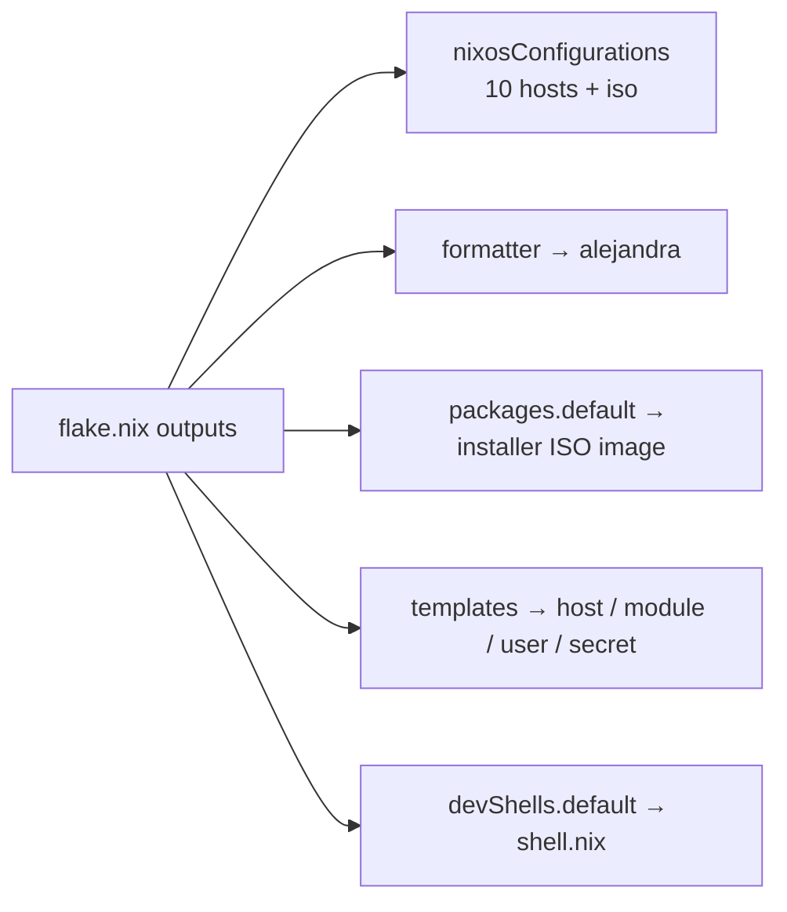

# Flake & Inputs

`flake.nix` is the single entry point. It pins inputs, defines the `mkSystem` helper, declares every machine, and exposes the dev shell, formatter, ISO package, and templates.

---

## Inputs

| Input | Source | Purpose |
|-------|--------|---------|
| `nixpkgs` | `github:nixos/nixpkgs/nixos-unstable` | Base package set (unstable channel) |
| `nixos-hardware` | `github:NixOS/nixos-hardware/master` | Hardware quirk fixes (e.g. Framework laptops) |
| `flatpaks` | `github:in-a-dil-emma/declarative-flatpak/latest` | Declarative Flatpak management |
| `preservation` | `github:nix-community/preservation` | Impermanence-style state/file preservation |
| `stylix` | `github:danth/stylix` | System-wide theming |
| `microvm` | `github:microvm-nix/microvm.nix` | MicroVM / QEMU guest framework |
| `hyprland` | `github:hyprwm/Hyprland` | Hyprland Wayland compositor |
| `hyprland-plugins` | `github:hyprwm/hyprland-plugins` | Hyprland plugins (pins its `hyprland` input) |
| `disko` | `github:nix-community/disko` | Declarative disk partitioning/formatting |
| `home-manager` | `github:nix-community/home-manager` | Per-user home configuration |
| `agenix` | `github:ryantm/agenix` | Age-based secret management (Yubikey-backed) |
| `arion` | `github:hercules-ci/arion` | Docker-Compose-style declarative containers |
| `antlers` | `github:CalamooseLabs/antlers/flakes?dir=flakes` | In-house flake; provides the Nix-enabled `zed-editor` used in the dev shell |
| `openreturn` | `github:CalamooseLabs/OpenReturn` | In-house app/service (consumed by the `openreturn` module) |
| `quorumcall` | `github:CalamooseLabs/QuorumCall` | In-house app/service (consumed by the `quorumcall` module) |

Most inputs `follows = nixpkgs` to avoid duplicate nixpkgs evaluations. Note `antlers` uses the non-standard `…/flakes?dir=flakes` form to pin a branch **and** a subdirectory as the flake root.

---

## `mkSystem`

Every machine (except the ISO) is produced by this helper:

```nix
mkSystem = hostname: extraSpecialArgs:
  nixpkgs.lib.nixosSystem {
    inherit system;                                   # "x86_64-linux"
    specialArgs =
      { inherit inputs cala-m-os initialInstallMode; }
      // extraSpecialArgs;
    modules = [
      ./hosts/${hostname}/configuration.nix
      { nixpkgs.overlays = import ./overlays; }
    ];
  };
```

| Concern | Behavior |
|--------|----------|
| `hostname` | Selects `./hosts/<hostname>/configuration.nix` as the only top-level module |
| `extraSpecialArgs` | Merged over the base args; used to pass `self` to the two hosts that need it (`lanstation`, `homelab`) |
| `specialArgs` | Always provides `inputs`, `cala-m-os` (= `settings.nix`), and `initialInstallMode` |
| `system` | Hard-coded `x86_64-linux` (no `flake-utils`) |
| overlays | Applied via an inline module (`nixpkgs.overlays = import ./overlays`) |

Everything else (home-manager, disko, stylix, the machine/user/module tree) is pulled in **deeper**, by the host → `_core` chain — not at this top level. See [[Configuration Hierarchy|Configuration-Hierarchy]].

---

## Outputs



- **`nixosConfigurations`** — `lanstation`, `devbox`, `ephemeral`, `homelab`, `simple`, `battlestation`, `broadcast`, `openreturn`, `livedata`, `ai`, plus `iso`. The `iso` is built directly (not via `mkSystem`) and gets only `inputs` in `specialArgs`. See [[Hosts|Hosts]].
- **`formatter`** → `alejandra` (so `nix fmt` ≡ `alejandra .`).
- **`packages.x86_64-linux.default`** → `nixosConfigurations.iso.config.system.build.isoImage`, so `nix build` builds the ISO.
- **`templates`** → imported from `./templates` (see below).
- **`devShells.${system}.default`** → `./shell.nix`.

There are **no `apps` and no `checks`** outputs.

---

## Overlays

`overlays/default.nix` is currently the empty list:

```nix
[]
```

It's a wired-in extension point (imported by both the dev-shell `pkgs` and the `mkSystem` inline module) but presently overrides/adds nothing.

---

## Dev shell — `shell.nix`

`nix develop` provides:

| Tool | Purpose |
|------|---------|
| `alejandra` | The canonical Nix formatter |
| `nixd`, `nil` | Nix language servers |
| `claude-code` | Claude Code CLI |
| `flash-iso` | Interactive ISO build-and-flash helper (below) |
| `zed-editor` (from `antlers`) | Nix-enabled Zed, pre-wired to use `nil`/`nixd` + `alejandra` formatting |

The shell hook prints `Using Local Nix-Enabled Zed!`.

### `flash-iso`

A `writeShellApplication` that builds the ISO and writes it to a USB stick, interactively:

1. Resolve flake root (`git rev-parse --show-toplevel`).
2. List USB block devices (`lsblk -J | jq 'select(.tran=="usb")'`); abort if none.
3. Prompt for a target drive.
4. Show a destructive-data warning; require typing `YES`.
5. `nix build .#nixosConfigurations.iso.config.system.build.isoImage`.
6. Unmount any mounted partitions on the target.
7. `sudo dd if=<iso> of=<device> bs=4M status=progress oflag=sync`.

Run it with `nix develop -c flash-iso`.

---

## Templates

`templates/default.nix` exposes four scaffolds (no `default` alias — you must name one):

| Template | Creates | Notes |
|----------|---------|-------|
| `host` | a host flake skeleton | |
| `module` | a module skeleton | |
| `user` | a user profile skeleton | |
| `secret` | an agenix secret bundle | `welcomeText` reminds: `agenix -e <file>.age -i ./identities/yubi.key` |

```bash
nix flake init -t /etc/nixos#module
```

See [[Common Tasks|Common-Tasks]] for end-to-end recipes.

---

## `initialInstallMode` threading

`flake.nix` reads an env var at evaluation time (impure):

```nix
initialInstallMode = builtins.getEnv "INITIAL_INSTALL_MODE" == "1";
```

This boolean is injected into every host's `specialArgs` and is the switch that selects the minimal first-pass config during installation. It requires `--impure` when evaluated, which is why the installer passes it. Full detail in [[ISO & Installer|ISO-Installer]] and [[Configuration Hierarchy|Configuration-Hierarchy]].
