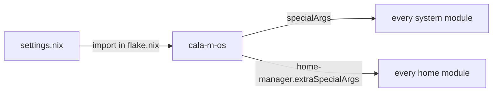

# Global Settings (`settings.nix`)

`settings.nix` is a plain attrset, imported once in `flake.nix` as `cala-m-os` and injected into **every** module (system and home) through `specialArgs` / `extraSpecialArgs`. It's the single source of truth for fleet-wide constants.

```nix
# Access it anywhere
{cala-m-os, ...}:
cala-m-os.globals.defaultUser   # "hub"
cala-m-os.globals.TZ            # "America/Denver"
cala-m-os.ip.gateway            # "10.10.10.1"
cala-m-os.fqdn                  # "calamooselabs.com"
```



---

## `globals`

| Key | Value | Used for |
|-----|-------|----------|
| `globals.defaultUser` | `"hub"` | Canonical primary username; greetd default session; nix trusted-users; `/etc/nixos` owner; the switcher account |
| `globals.adminGroup` | `"wheel"` | Admin group; `/etc/nixos` group; sudo |
| `globals.defaultEmail` | `"it@calamos.family"` | git config, ACME account email |
| `globals.fullName` | `"Cole J. Calamos"` | git, GECOS |
| `globals.TZ` | `"America/Denver"` | `time.timeZone` |

## Lab / FQDN / networking

| Key | Value | Used for |
|-----|-------|----------|
| `fqdn` | `"calamooselabs.com"` | Lab domain; ACME wildcard; Caddy vhosts |
| `networking.prefixLength` | `"26"` | Subnet prefix (/26) as a string |
| `networking.network-name` | `"10-macvtap"` | Name of the macvtap systemd-network definition |

## `ip` — static address table (10.10.10.0/26)

| Key | Address | Host |
|-----|---------|------|
| `ip.gateway` | `10.10.10.1` | Default gateway |
| `ip.media` | `10.10.10.10` | media (Plex) guest |
| `ip.lab` | `10.10.10.15` | lab host |
| `ip.battlestation` | `10.10.10.30` | battlestation |
| `ip.torrent` | `10.10.10.35` | torrent guest |
| `ip.htpc` | `10.10.10.40` | HTPC |
| `ip.lanstation-1` | `10.10.10.41` | lanstation NIC 1 |
| `ip.lanstation-2` | `10.10.10.42` | lanstation NIC 2 / VM |
| `ip.lanstation-3` | `10.10.10.43` | lanstation NIC 3 / VM |
| `ip.lanstation-4` | `10.10.10.44` | lanstation NIC 4 / VM |
| `ip.vault` | `10.10.10.45` | vault guest |

The [[MicroVMs|MicroVMs]] manager looks up `cala-m-os.ip.<vmName>` to assign a guest its static IP (unless overridden). See [[Networking|Networking]].

## `nfs` — NAS paths

NFS server: `nfs.server = "nas.calamos.family"`.

| Key | Path |
|-----|------|
| `nfs.media.movies` | `/mnt/Media Library/Movies` |
| `nfs.media.tv-shows` | `/mnt/Media Library/TV-Shows` |
| `nfs.media.lancache` | `/mnt/Media Library/Cache` |
| `nfs.backup.plex` | `/mnt/Media Library/Backups/Plex` |
| `nfs.backup.radarr` | `/mnt/Media Library/Backups/Radarr` |
| `nfs.backup.sonarr` | `/mnt/Media Library/Backups/Sonarr` |
| `nfs.backup.prowlarr` | `/mnt/Media Library/Backups/Prowlarr` |

These are the export paths on the NAS used by the Plex/\*arr media stack.

---

## Conventions & gotchas

- **Prefer `cala-m-os` over literals.** Module code reads `cala-m-os.globals.*`, `cala-m-os.ip.*`, etc. rather than hard-coding values.
- **`prefixLength` is a string.** Some hosts that need an integer hard-code `26` rather than reading the string — be aware when reusing it.
- **The `iso` config does not receive `cala-m-os`.** It's built with `specialArgs = { inherit inputs; }` only. Don't reference `cala-m-os` from `iso/`.
