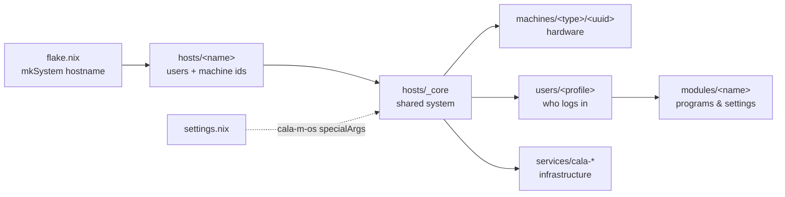

# Cala-M-OS Wiki

> _Calamoose Labs Presents_ — **C A L A · M · O S**

**Cala-M-OS** is a single, multi-host [NixOS](https://nixos.org) flake that builds every machine in the fleet — from single-board computers and laptops to workstations, headless servers, and MicroVM guests — plus a custom, Yubikey-authenticated installer ISO. One repository, one set of conventions, every machine.

This wiki is the deep technical reference. If you want to understand *how a hostname turns into a running system*, *where a setting lives*, or *how to add a new host/module/user/secret*, start here.

---

## What makes this repo tick

- **Layered, top-down configuration.** A host says *who and what* it is; everything else is inherited from a shared `_core`, a hardware layer, a module catalog, and per-user profiles. See **[[Configuration Hierarchy|Configuration-Hierarchy]]**.
- **Hardware-agnostic hosts.** A host names a `machine_uuid`; the machine layer supplies the disko layout, kernel, and GPU/CPU specifics. See **[[Machines|Machines]]**.
- **Two-file modules.** Every feature is a `modules/<name>/` with a system half (`configuration.nix`) and a home-manager half (`home.nix`). See **[[Modules|Modules]]**.
- **Idiomatic services.** Heavier infrastructure (reverse proxy, ACME certs, MicroVM management) are real NixOS modules under `services.cala-*`. See **[[Services|Services]]**.
- **Persona switching.** A `hub` session user can adopt other users' environments live, no re-login. See **[[User Switching|User-Switching]]**.
- **Yubikey-rooted secrets.** agenix encrypts to hardware Yubikeys; the same keys do SSH and GPG. See **[[Secrets & Security|Secrets-and-Security]]**.
- **MicroVMs.** VM hosts declare guests declaratively; secrets fan out over virtiofs. See **[[MicroVMs|MicroVMs]]**.
- **Two-pass installer.** A custom ISO bootstraps a minimal system, then rebuilds the full config. See **[[ISO & Installer|ISO-Installer]]**.

---

## The 10-second mental model



---

## Page index

| Page | What it covers |
|------|----------------|
| **[[Architecture Overview|Architecture-Overview]]** | The big picture, every folder, the master diagram |
| **[[Flake & Inputs|Flake-and-Inputs]]** | `flake.nix`, inputs, `mkSystem`, outputs, overlays, dev shell, `flash-iso`, templates |
| **[[Configuration Hierarchy|Configuration-Hierarchy]]** | Exact control flow: hostname → full system |
| **[[Global Settings|Global-Settings]]** | `settings.nix` / the `cala-m-os` reference |
| **[[Hosts|Hosts]]** | Host layer, the full host table, adding a host |
| **[[Machines|Machines]]** | Workstations, VM sizes, hardware modules, disko |
| **[[Modules|Modules]]** | The two-file module system + full catalog |
| **[[Services|Services]]** | `cala-caddy`, `cala-certs`, `cala-vm-manager` |
| **[[Users & Profiles|Users-and-Profiles]]** | Profiles, the user `_core` engine |
| **[[User Switching|User-Switching]]** | The persona switching system |
| **[[Secrets & Security|Secrets-and-Security]]** | agenix, Yubikey, GPG, secret inventory |
| **[[MicroVMs|MicroVMs]]** | `cala-vm-manager` deep dive, passthrough, networking |
| **[[Networking|Networking]]** | IP plan, macvtap, bridges, firewall |
| **[[ISO & Installer|ISO-Installer]]** | Custom ISO, two-pass install, `INITIAL_INSTALL_MODE` |
| **[[Common Tasks|Common-Tasks]]** | Cookbook: rebuild, add host/module/user/secret, build & flash ISO |
| **[[Glossary|Glossary]]** | Project-specific terms |

---

## Quick commands

```bash
# Rebuild & switch the current host
sudo nixos-rebuild switch --flake .#<hostname>

# Format all Nix files
alejandra .            # or: nix fmt

# Enter the dev shell (alejandra, nixd, nil, claude-code, flash-iso, zed)
nix develop

# Build the installer ISO
nix build .#nixosConfigurations.iso.config.system.build.isoImage   # == nix build .#default

# Build & flash the ISO to USB (interactive)
nix develop -c flash-iso
```

> **Note:** This wiki is maintained as Markdown under `wiki/` in the repo so it can be pushed to the GitHub Wiki. Page links use GitHub-Wiki `[[Title|Page-Name]]` syntax. Diagrams use Mermaid fenced code blocks, which GitHub renders natively.
