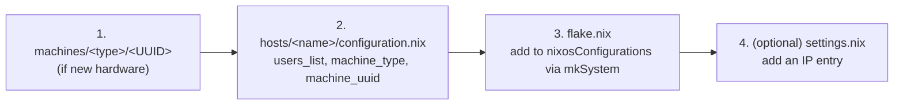

# Hosts

A **host** answers one question: *who and what is this machine?* It picks its users and its hardware identity, then inherits everything else from `hosts/_core`. Hosts are **hardware-agnostic** — the only exception is a VM host that must pass a device through to its guests.

See [[Configuration Hierarchy|Configuration-Hierarchy]] for how a host file expands into a full system.

---

## Flake-wired hosts

These are the machines declared in `flake.nix` under `nixosConfigurations` (buildable with `nixos-rebuild ... --flake .#<name>`):

| Host | `machine_uuid` | Type | User profile | Secrets | Notes |
|------|----------------|------|--------------|---------|-------|
| `lanstation` | `B760-PLUS` | Workstation | `gamer` | on | VFIO/VM host; receives `self`; static NICs (NetworkManager forced off) |
| `devbox` | `FW16-AMD-AI` | Workstation | `debugger` | on | Framework 16 + NVIDIA 5070; printing; docs forced on |
| `ephemeral` | `ZIMA` | Workstation | `void` | on | Zima Board 2 SBC |
| `lab` | `MS-02` | Workstation | `server` | on | MicroVM host (media + torrent guests); ACME certs; receives `self` |
| `simple` | `FW13-12XXP` | Workstation | `basic` | on | Framework 13 (12th-gen Intel); imports `_core/configuration.nix` directly |
| `battlestation` | `B850-MAX` | Workstation | `mixer` | on | Ryzen 9800X3D + RTX 5090; PipeWire |
| `studio` | `TRX50-SAGE` | Workstation | `streamer` | **off** | Threadripper; OBS kiosk via greetd+cage; RTX Pro 4000 |
| `openreturn` | `Small` | **VM** | `server` | **off** | MicroVM guest for the OpenReturn service |
| `livedata` | `MS-01` | Workstation | `server` | **off** | MicroVM host (openreturn + quorumcall guests) |
| `iso` | — | — | — | — | Custom installer image; built directly (not via `mkSystem`) |

`lanstation` and `lab` are the only hosts that receive `self` in `specialArgs`. Hosts with `calamoose.enableSecrets = false` build without needing Yubikey-decryptable secrets — see [[Secrets & Security|Secrets-and-Security]].

> **All wired hosts are single-user today.** Each `users_list` has exactly one profile, so the [[persona switching|User-Switching]] feature is not active on any of them. The machinery is ready the moment a host lists two or more profiles.

---

## Guest / unwired host directories

`hosts/` also contains directories that are **not** in `flake.nix`'s `nixosConfigurations`. They fall into two groups:

**MicroVM guests** (built *inside* a VM host via `cala-vm-manager`, not standalone):

| Dir | Type | Built by | Role |
|-----|------|----------|------|
| `media` | VM `Small` | `lab` | Plex media server |
| `torrent` | VM `X-Small` | `lab` | \*arr stack + qBittorrent over VPN |
| `quorumcall` | VM `Small` | `livedata` | QuorumCall service |
| `htpc` | VM `Large` | (planned) | Home-theater PC |
| `vault` | VM `Small` | (planned) | Secrets/storage |

> A guest's hostname is set by the manager via `networking.hostName = lib.mkForce <name>`. The `openreturn` guest reuses the flake host `openreturn` via `hostOverride`. See [[MicroVMs|MicroVMs]].

**Other variants / WIP:** `lanstation-multi` (multi-NIC VM host — the multi-user example), `lanstation-vm` (guest config used via `hostOverride`), `ai`, `travel`. These exist on disk but aren't currently wired.

---

## Anatomy of a host file

```nix
{cala-m-os, ...}: let
  import_users = ["mixer"];
  machine_type = "Workstation";
  machine_uuid = "B850-MAX";
in {
  imports = [
    (import ../_core/default.nix {
      users_list = import_users;
      machine_type = machine_type;
      machine_uuid = machine_uuid;
      extra_user_modules = {};
    })
  ];

  networking.hostName = "battlestation";

  # host-specific extras only — e.g. PipeWire
  security.rtkit.enable = true;
  services.pipewire = { enable = true; alsa.enable = true; pulse.enable = true; };
}
```

A host file should contain **only** what is genuinely host-specific: the hostname, host-level service tweaks, static networking, `calamoose.enableSecrets = false`, and (for VM hosts) a `vms.nix` import. Hardware belongs in [[Machines|Machines]]; programs belong in [[Modules|Modules]].

### VM hosts add a `vms.nix`

```nix
imports = [ (import ../_core/default.nix { … }) ]
  ++ lib.optional (!initialInstallMode) ./vms.nix;
```

The `!initialInstallMode` guard keeps VMs out of the minimal first install pass. See [[MicroVMs|MicroVMs]] and [[ISO & Installer|ISO-Installer]].

### Special host behaviors worth knowing

- **`studio`** runs OBS as a kiosk: greetd's session launches `cage -s -- obs` instead of a shell.
- **`lanstation`** forces `networking.networkmanager.enable = lib.mkForce false` (static interface config) — overriding the `non-vm.nix` default.
- **`simple`** bypasses `_core/default.nix` and imports `_core/configuration.nix` directly (so no install-mode switch).
- **`devbox`** sets `documentation.enable = lib.mkForce true`.

---

## Adding a new host



1. **Hardware** — if the machine is new, create `machines/workstations/<UUID>/` (or use an existing one). See [[Machines|Machines]].
2. **Host file** — `hosts/<name>/configuration.nix` declaring `users_list`, `machine_type`, `machine_uuid`, and importing `_core/default.nix`.
3. **Register** — add `<name> = mkSystem "<name>" {};` to `flake.nix`.
4. **Network** — add a `settings.nix` `ip.<name>` entry if it needs a static address.

Then `nix flake init -t .#host` gives you a starting skeleton, and `sudo nixos-rebuild switch --flake .#<name>` builds it. Recipe in [[Common Tasks|Common-Tasks]].
