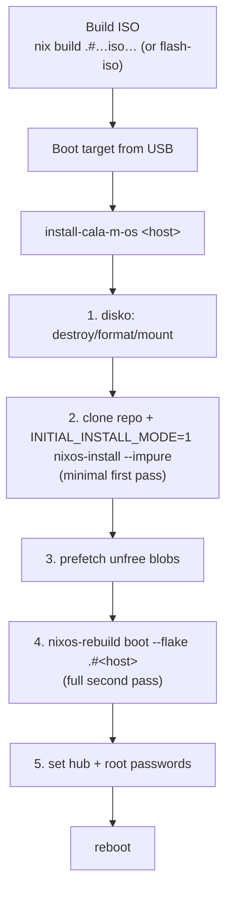
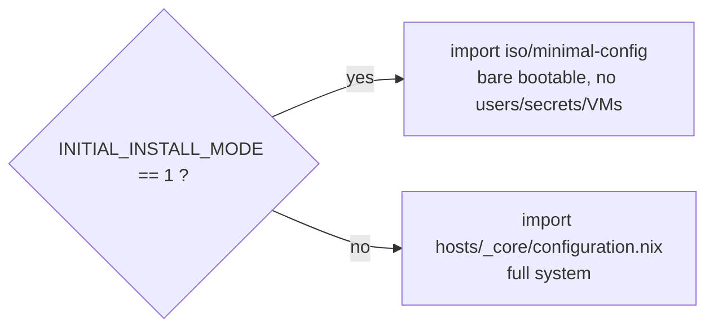

# ISO & Installer

Cala-M-OS ships a custom installer ISO that you can SSH into using only a Yubikey, and a **two-pass install** that bootstraps a minimal system before building the full configuration.



---

## Building the ISO

```bash
nix build .#nixosConfigurations.iso.config.system.build.isoImage   # == nix build .#default
# or, interactively build + flash to USB:
nix develop -c flash-iso
```

The ISO is also the flake's `packages.default`. `flash-iso` is documented in [[Flake & Inputs|Flake-and-Inputs]].

---

## What's on the ISO (`iso/default.nix`)

- Based on `installation-cd-minimal.nix`; flakes + `nix-command` + `allowUnfree`.
- **SSH forced up** (`sshd.wantedBy = ["multi-user.target"]`); root authorized keys are the two `sk-ssh-ed25519` FIDO2 keys in `iso/public_keys/`; `pcscd` enabled. → You can SSH into the live installer with only the Yubikey.
- Hostname `cala-m-os-installer`; `forceTextMode`; `lz4` squashfs.
- Packages: `disko`, `git`, `neovim`, a bash-completion script, and the `install-cala-m-os` script.
- **Bash completion** completes the host argument from a static list:
  `lanstation devbox ephemeral lab simple battlestation studio openreturn livedata`.

> The `iso` config is built directly (not via `mkSystem`) and gets only `inputs` in `specialArgs` — no `cala-m-os`, no `initialInstallMode`.

---

## `install-cala-m-os <host>` — step by step

| Step | Action |
|------|--------|
| **1. Format** | `disko --mode destroy,format,mount --flake github:CalamooseLabs/cala-m-os#<host> --yes-wipe-all-disks` — pulls the host's disko layout from GitHub and partitions/mounts at `/mnt` |
| **2. Minimal install** | clone repo to `/mnt/etc/nixos`, then `INITIAL_INSTALL_MODE=1 nixos-install --flake /mnt/etc/nixos#<host> --impure --no-root-password` |
| **3. Prefetch** | `nix-prefetch-url file:///mnt/etc/nixos/prefetch/displaylink-620.zip` (host + inside `nixos-enter`) — pre-seeds the unfree DisplayLink blob |
| **4. Full build** | `nixos-enter -- nixos-rebuild boot --flake /etc/nixos#<host>` — the full config (all users/modules/secrets/VMs) becomes the boot generation |
| **5. Passwords** | prompt + confirm, then `chpasswd` for `hub` and `root` |

Then reboot.

---

## Machine override — build a host onto different hardware

A host has a **default** machine (its `machine_uuid`), but you can override which machine it builds to at install time — e.g. to try the `devbox` software stack on an `MS-01` box:

```bash
sudo install-cala-m-os devbox MS-01
```

The optional second argument is any directory name under `machines/workstations/` or `machines/vms/` (the type — Workstation vs VM — is auto-detected from which folder contains it). Tab-completion offers the machine list.

How it flows:

```mermaid
flowchart TD
  A["install-cala-m-os devbox MS-01"] --> B["export MACHINE_OVERRIDE=MS-01"]
  B --> C["disko (--impure) → formats MS-01's layout"]
  B --> D["nixos-install (--impure) → minimal MS-01"]
  B --> E["write machine-override.nix:<br/>{ devbox = \"MS-01\"; }"]
  E --> F["nixos-rebuild boot (--impure) → full MS-01"]
  E --> G["future rebuilds on the box<br/>read the file → stay on MS-01"]
```

- **Live (install):** the `MACHINE_OVERRIDE` env var is read by `flake.nix` (`builtins.getEnv`, like `INITIAL_INSTALL_MODE`) and injected via `specialArgs`. Because disko evaluates with `--impure` and both install passes pass `--impure`, every step resolves to the overridden machine.
- **Persistent (after install):** the installer writes a per-host entry into `machine-override.nix` on the target, so future `nixos-rebuild` on that box keeps targeting the override without the env var. The env var takes precedence over the file.

Resolution lives in `machines/resolve.nix`, used by both `hosts/_core/configuration.nix` and the minimal install config, so the override applies to the disko/hardware in both passes. See [[Machines|Machines]] and [[Configuration Hierarchy|Configuration-Hierarchy]].

> **Persisting without reinstalling:** add an entry to `machine-override.nix` directly, e.g. `{ devbox = "MS-01"; }`, and rebuild. Remove it to revert to the host default.

---

## `INITIAL_INSTALL_MODE` — the two-pass switch

The flake reads the env var at eval time (impure, hence `--impure`):

```nix
initialInstallMode = builtins.getEnv "INITIAL_INSTALL_MODE" == "1";
```

It threads into every host's `specialArgs` and drives the branch in `_core/default.nix`:



It also:
- **gates VM stacks**: `lib.optional (!initialInstallMode) ./vms.nix` on `lab`, `livedata`, `lanstation-multi` — VMs (which depend on host secrets) are skipped on the first pass.
- **propagates into guests**: `cala-vm-manager` re-injects `initialInstallMode` into each guest's `specialArgs`.

This is what lets a brand-new machine reach a bootable state **before** the Yubikey-backed secrets and VMs come online. The second pass (env var unset) builds everything.

---

## `iso/minimal-config/configuration.nix`

The minimal first-pass system: takes `{machine_type, machine_uuid}`, computes the machine path, and imports `_core/options.nix` (so `calamoose.enableSecrets` exists), the machine's `hardware-configuration.nix`, the disko module + the machine's `disko.nix`. Sets systemd-boot/EFI, NetworkManager, timezone, flakes, `allowUnfree`, `pcscd`, and packages `disko` + `git`. Bootable and disko-aware, but no users or secrets.

---

## Post-install key setup

After first boot, restore the Yubikey-backed keys (also in the README):

**GPG signing key**
```bash
sudo cp /run/agenix/yubigpg.asc .
sudo chown <you>:users yubigpg.asc
gpg --import yubigpg.asc
rm yubigpg.asc
```

**SSH (FIDO2 resident keys)**
```bash
cd ~/.ssh
ssh-keygen -K                 # pull resident keys off the Yubikey
eval "$(ssh-agent -s)"
# rename to id_ed25519_sk{,.pub}
ssh-add ~/.ssh/id_ed25519_sk
```

See [[Secrets & Security|Secrets-and-Security]] for the trust model.
