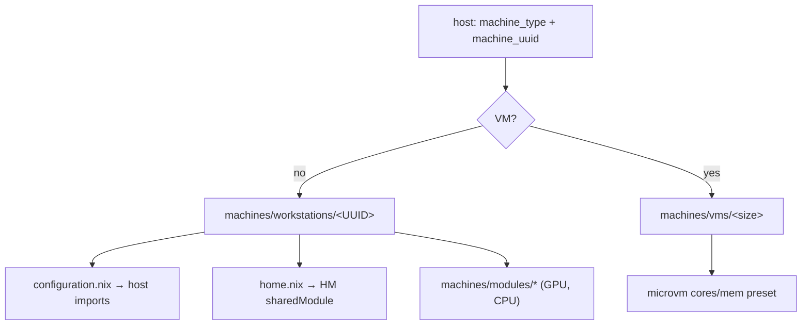

# Machines (Hardware Layer)

The `machines/` tree owns everything hardware-specific so that [[Hosts|Hosts]] can stay hardware-agnostic. A host names a `machine_uuid` and `machine_type`; `_core` resolves it to a directory:

```nix
isVM = machine_type == "VM" || machine_type == "vm";
machine_root = ../../machines + (if isVM then "/vms" else "/workstations");
machine_path = machine_root + "/${machine_uuid}";
```

Each machine directory contributes a **system layer** (`configuration.nix`, imported into the host) and a **home layer** (`home.nix`, injected as a home-manager shared module for every user).



---

## Workstations

`machines/workstations/<UUID>/` — physical hardware. Every directory carries: `configuration.nix`, `disko.nix`, `hardware-configuration.nix`, `home.nix`. Some add a per-machine `modules/hyprland/` override.

| UUID          | Hardware                                                          | GPU module | CPU module | nixos-hardware                          | hyprland override |
| ------------- | ----------------------------------------------------------------- | ---------- | ---------- | --------------------------------------- | ----------------- |
| `A520M-ITX`   | ASRock A520M-ITX, Ryzen 5 5600, RTX 4070 Ti                       | —          | —          | —                                       | no                |
| `B760-PLUS`   | RTX 5090 FE box (used by `lanstation`)                            | nvidia-gpu | —          | —                                       | no                |
| `B850-MAX`    | MSI B850, Ryzen 9800X3D, RTX 5090                                 | nvidia-gpu | amd-cpu    | —                                       | **yes**           |
| `FW13-11XXP`  | Framework 13, 11th-gen Intel                                      | —          | —          | `framework-11th-gen-intel`              | **yes**           |
| `FW13-12XXP`  | Framework 13, 12th-gen Intel                                      | —          | —          | `framework-12th-gen-intel`              | **yes**           |
| `FW16-AMD-AI` | Framework 16 AMD + NVIDIA 5070                                    | nvidia-gpu | —          | `framework-16-amd-ai-300-series-nvidia` | **yes**           |
| `MS-01`       | Minisforum MS-01                                                  | —          | —          | —                                       | no                |
| `MS-02`       | Minisforum MS-02 + RTX Pro 4000                                   | nvidia-gpu | —          | —                                       | no                |
| `TRX50-SAGE`  | ASUS Pro WS TRX50-Sage, Threadripper 7960X, RTX 5090 + RX 9060 XT | nvidia-gpu | —          | —                                       | no                |
| `ZIMA`        | Zima Board 2                                                      | —          | —          | —                                       | no                |

Most pin `boot.kernelPackages = pkgs.linuxPackages_latest` (the two FW13 Intel laptops rely on their nixos-hardware modules instead).

### Example: PRIME offload (`B850-MAX`)

```nix
imports = [ ./hardware-configuration.nix ./disko.nix
            ../../modules/nvidia-gpu/configuration.nix
            ../../modules/amd-cpu/configuration.nix ];
hardware.nvidia.prime = {
  offload.enable = true;
  nvidiaBusId = "PCI:001:0:0";
  amdgpuBusId  = "PCI:014:0:0";
};
```

The reusable `nvidia-gpu` module installs the driver; the **bus IDs stay in the machine file** because they're hardware-specific. This is the project's recurring pattern: generic module + hardware-local override.

### Example: VFIO passthrough host (`TRX50-SAGE`)

```nix
boot.kernelParams = [
  "amd_iommu=on" "iommu=pt"
  "vfio-pci.ids=1002:7590,1002:ab40,1002:7480,1002:ab30"  # RX 9060 XT + W7600 (GPU+audio)
];
```

The secondary GPUs are bound to `vfio-pci` for guest passthrough while the NVIDIA card serves the host.

### disko layouts

- **B850-MAX / FW16-AMD-AI** — single NVMe, GPT: 500M ESP (vfat `/boot`) · ext4 `/` (`end = "-70G"`) · 10M random-encrypted swap · remaining swap (hibernation `resumeDevice = true`).
- **TRX50-SAGE** — three disks: `nvme2` boot (512M ESP + ext4 `/`); `nvme0` + `nvme1` each an mdraid member → **RAID 0 xfs `recordings`** at `/recordings` (`noatime,nodiratime`) for high-throughput VM storage.

### Per-machine module overrides

Four workstations carry `modules/hyprland/` to target hardware-specific displays the generic [[hyprland module|Modules]] can't know:

- `B850-MAX` — single 4K@119.88 monitor + audio keybinds.
- `FW16-AMD-AI` — internal `eDP-2 2560x1600@165`, external MSI OLED, brightness keys, lid-switch lock/disable. Its `home.nix` also sets `geforceNow.gpuType = "nvidia"`.

The machine's `home.nix` imports the override (`./modules/hyprland/home.nix`).

---

## Hardware modules (`machines/modules/`)

Imported by **workstation `configuration.nix` files**, not by hosts. All four are system-only (`home.nix` is an empty stub).

| Module       | Enables                                                                                                                                                                                                                                    |
| ------------ | ------------------------------------------------------------------------------------------------------------------------------------------------------------------------------------------------------------------------------------------ |
| `nvidia-gpu` | `hardware.graphics` (+32-bit), `hardware.nvidia` (open kernel module, modesetting, stable driver, `nvidiaSettings`), `videoDrivers=["nvidia"]`, nvidia kernel modules, `nvidia-drm.modeset=1`. **PRIME is _not_ here** — it's per-machine. |
| `amd-gpu`    | `hardware.graphics` (+32-bit), `videoDrivers=["amdgpu"]`, redistributable firmware, early-KMS `amdgpu` initrd module                                                                                                                       |
| `intel-gpu`  | `intel-media-driver`, `intel-compute-runtime`, `intel-gpu-tools`                                                                                                                                                                           |
| `amd-cpu`    | Blacklists `k10temp`, loads `zenpower` for better Zen sensors (only `B850-MAX` uses it)                                                                                                                                                    |

---

## VM presets (`machines/vms/`)

`_core/configuration.nix` is a curried function `{cores, memory}: {…}: {…}` that imports `inputs.microvm.nixosModules.microvm` and sets:

```nix
microvm = {
  vcpu = cores;
  mem  = 1024 * memory;          # memory is in GiB
  balloon = lib.mkDefault true;
  hypervisor = lib.mkDefault "qemu";
  graphics.enable = lib.mkDefault false;     # headless
  writableStoreOverlay = lib.mkDefault "/nix/.rw-store";
};
```

The size variants set `cores`/`memory` and import `_core`:

| Size      | vCPU | RAM    |
| --------- | ---- | ------ |
| `X-Small` | 2    | 4 GiB  |
| `Small`   | 4    | 8 GiB  |
| `Medium`  | 6    | 16 GiB |
| `Large`   | 8    | 16 GiB |

(`Medium` and `Large` share 16 GiB; they differ only in vCPU count.)

A host with `machine_type = "VM"` selects one of these as its `machine_uuid`. The full guest-creation flow — passthrough, volumes, networking, secret sharing — is in [[MicroVMs|MicroVMs]].
