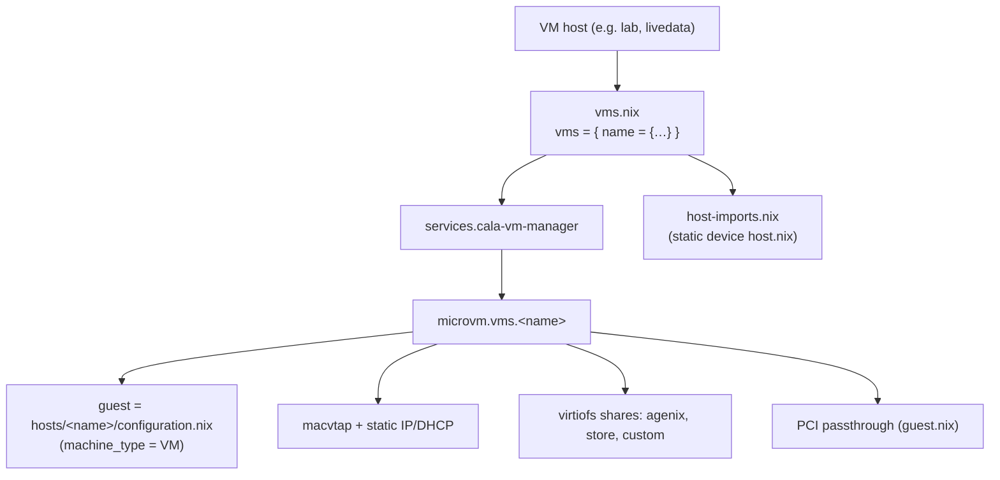
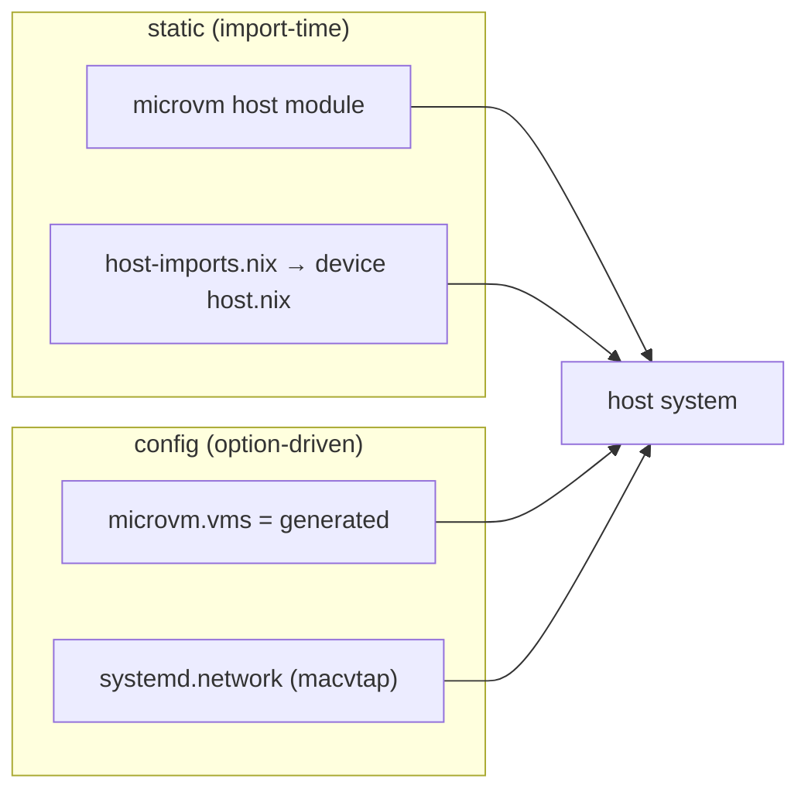
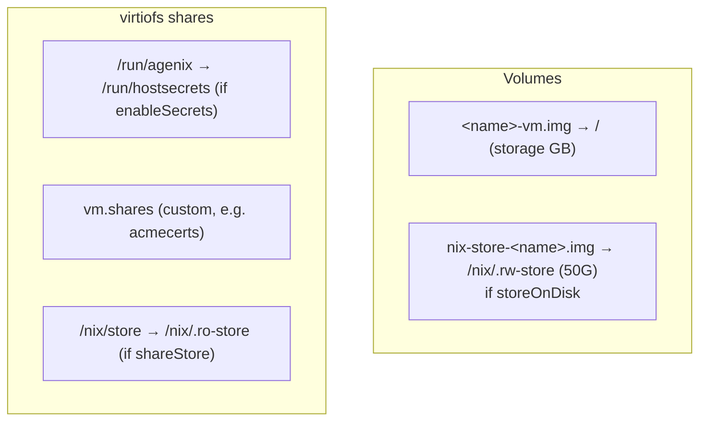

# MicroVMs

VM hosts run their guests as [microvm.nix](https://github.com/microvm-nix/microvm.nix) QEMU MicroVMs. MicroVM is the **only** virtualization type in the fleet — there are no traditional virtual servers. Guests are declared declaratively via the [[`cala-vm-manager` service|Services]].



---

## How a VM host declares guests

A VM host imports the manager and sets `services.cala-vm-manager`:

```nix
# hosts/livedata/vms.nix
let
  vms = {
    "openreturn" = {
      devices = [];
      storage = 600;                 # GB root volume
      shares = [];
      hostOverride = "openreturn";
      ipOverride = "10.1.10.41";
      gatewayOverride = "10.1.10.1";
      dns = ["10.1.10.1"];
    };
    "quorumcall" = { devices = []; storage = 100; shares = []; hostOverride = "quorumcall"; … };
  };
  bridgeInterface = "enp88s0";
in {
  imports =
    [ ../../services/vm-manager ]
    ++ (import ../../services/vm-manager/host-imports.nix { devicePath = ./devices; inherit vms; });

  services.cala-vm-manager = {
    enable = true;
    devicePath = ./devices;
    networkInterface = bridgeInterface;
    inherit vms;
  };
}
```

The `vms.nix` is imported by the host only when `!initialInstallMode` (VMs are skipped on the first install pass).

---

## The `vms` submodule

Each guest is a typed submodule (`services.cala-vm-manager.vms.<name>`):

| Field | Type | Default | Meaning |
|-------|------|---------|---------|
| `storage` | positive int | — | Root volume size in GB |
| `devices` | list of str | `[]` | Device names (under `devicePath`) to pass through |
| `shares` | list of attrs | `[]` | Extra virtiofs shares |
| `autostart` | bool | `true` | Start with the host |
| `shareStore` | bool | `true` | Share host `/nix/store` read-only |
| `storeOnDisk` | bool | `false` | Give the guest a writable on-disk nix store |
| `hostOverride` | nullOr str | `null` | Build the guest from a different host config than its name |
| `ipOverride` | nullOr str | `null` | Static IP, overriding the `settings.nix` lookup |
| `gatewayOverride` | nullOr str | `null` | Gateway override |
| `dns` | nullOr list str | `null` | DNS servers (defaults to gateway) |
| `mac` | nullOr str | `null` | Explicit MAC (else derived from IP or name) |

The guest's own config comes from `hosts/<hostOverride or name>/configuration.nix`, built with `machine_type = "VM"` so it selects a [[VM size preset|Machines]] for cores/RAM.

---

## The `imports`-can't-depend-on-`config` constraint

NixOS forbids `imports` from depending on `config`. But the per-device **host** passthrough modules (`devices/<dev>/host.nix`, which set up VFIO/IOMMU on the *host*) must be top-level imports, and they're derived from the `vms` set.

Resolution: a small pure helper computes those import paths statically from the raw `vms`:

```nix
# services/vm-manager/host-imports.nix
{devicePath, vms}: let
  allDevices = builtins.concatLists (map (vm: vm.devices or []) (builtins.attrValues vms));
  uniqueDevices = builtins.attrNames (builtins.listToAttrs (map (d: {name = d; value = true;}) allDevices));
in map (device: devicePath + "/${device}/host.nix") uniqueDevices
```

The host adds these to its `imports`. Everything else — `microvm.vms`, guest networking — flows through the manager's `config = mkIf cfg.enable` block. The microvm host module (`inputs.microvm.nixosModules.host`) is imported statically inside the manager.



---

## Per-device passthrough files

`devicePath` (e.g. `hosts/lab/devices/`) holds one directory per device, each with:

- **`host.nix`** — host-side setup (VFIO binding, IOMMU). A top-level host import.
- **`guest.nix`** — guest-side `microvm.devices` PCI paths + any GPU module. Imported into the guest config.

Example (`hosts/lab/devices/arc-b50/guest.nix`):

```nix
{...}: {
  imports = [../../../../machines/modules/intel-gpu/configuration.nix];
  microvm.devices = [
    { bus = "pci"; path = "0000:44:00.0"; }   # GPU
    { bus = "pci"; path = "0000:45:00.0"; }   # GPU audio
  ];
}
```

> Confirm passthrough PCI addresses on the actual host with `lspci -nn | grep -i vga`.

---

## Networking

Each guest gets a `macvtap` interface bridged onto the host's `networkInterface`, with a derived MAC:

```nix
microvm.interfaces = [{
  type = "macvtap"; id = "vm-${name}"; mac = <derived>;
  macvtap = { mode = "bridge"; link = cfg.networkInterface; };
}];
```

MAC derivation: explicit `mac` → else from the last octet of a static IP (`02:00:00:00:00:<octet>`) → else hashed from the name. IP assignment:

- **Static** (`ipOverride` or `cala-m-os.ip.<name>`): systemd-networkd with `address`, default route via gateway (`GatewayOnLink`), DNS = `dns` or the gateway.
- **DHCP** otherwise.

The host also defines a `<network-name>-noip` rule marking `vm-*` links unmanaged. See [[Networking|Networking]].

---

## Volumes & shares



- **Root volume** `<name>-vm.img` sized `storage * 1024` MB.
- **Writable store** `nix-store-<name>.img` (50 GB) when `storeOnDisk`.
- **agenix share** read-only `/run/agenix → /run/hostsecrets` (gated on `enableSecrets`) — see [[Secrets & Security|Secrets-and-Security]].
- **Custom shares** from `vm.shares` (e.g. lab shares `/var/lib/acme/<fqdn> → /mnt/acme` for the media/torrent guests so Caddy can read certs).
- **Read-only store** `/nix/store → /nix/.ro-store` when `shareStore` (default).

The manager passes `inputs`, `cala-m-os`, `initialInstallMode` into each guest's `specialArgs`, so guests see the same flags as the host.

---

## Current VM hosts & guests

| Host | NIC | Guests |
|------|-----|--------|
| `lab` | `eno2` | `media` (Plex, passthrough `arc-b50` iGPU), `torrent` (\*arr + qBittorrent/VPN) |
| `livedata` | `enp88s0` | `openreturn`, `quorumcall` (10.1.10.0/24, custom gateway/DNS) |
| `lanstation-multi` | `eno2` | GPU/USB-passthrough gaming VMs (`amd-9060-xt`, `pci-usb-controller-*`) — unwired |

See [[Hosts|Hosts]] for the guest directory list.
