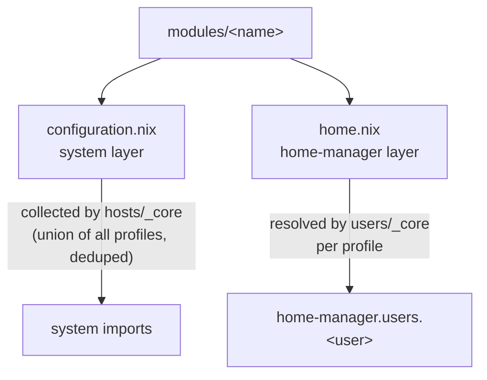

# Modules

Modules are the lightweight building blocks: a program plus its settings, or a shell script. There are ~89 of them under `modules/`. Users opt into modules by name; the core wires them in.

---

## The two-file convention

Every module directory ships **both** files (one may be an empty `{...}: {}` stub):

```
modules/<name>/
├── configuration.nix   # NixOS system-level config
└── home.nix            # home-manager (user-level) config
```



- **`configuration.nix`** is collected at the **host layer** (`hosts/_core/configuration.nix`): the union of every referenced module name across all profiles, deduplicated with `lib.unique`, imported once. System config is machine-global.
- **`home.nix`** is resolved at the **user layer** (`users/_core`): one import per module name, per profile, attached under `home-manager.users.<username>`. Each persona gets its own home tree.

A module can provide either half or both. The resolver tolerates a missing file. Full mechanics in [[Configuration Hierarchy|Configuration-Hierarchy]] and [[Users & Profiles|Users-and-Profiles]].

---

## How a user pulls in a module

In `users/<profile>/default.nix`, modules are listed as **bare name strings**:

```nix
modules = [ "bash" "git" "neovim" "hyprland" "waybar" "agenix" ];
```

Each `name` resolves to `modules/<name>/{configuration,home}.nix`. No paths, no imports — just names. See [[Users & Profiles|Users-and-Profiles]].

---

## Module catalog

> Generated from `modules/` — grouped by role. All ship both files; "system" / "home" notes which half carries the substance.

### Shell / terminal / CLI
`bash`, `ghostty` (terminal; sets `TERMINAL=ghostty`), `ttyd`, `btop`, `bat`, `direnv`, `nh` (nix helper), `sc-im`, `lf`, `yazi`

### Editors
`neovim` (full config: telescope, nvim-tree, bufferline, devicons…), `zed-editor`

### Desktop / Wayland / Hyprland
`hyprland`, `hyprlock`, `hypridle`, `hyprpaper`, `hyprscrolling`, `niri`, `waybar`, `ashell`, `nwg-dock`, `rofi`, `stylix` (system theming), `fonts`, `nautilus`, `imv`, `flameshot`, `fade-in`

### Dev / config tooling
`git` (GPG-signed commits, identity from `cala-m-os.globals`), `lazygit`, `rebuild-config` (lazygit-if-dirty → `nh os switch`), `restore-config` (`nix-store --verify --repair`), `edit-config`, `appimage`

### Hardware / peripherals
`fingerprint-scanner`, `flipperzero`, `solaar`, `streamdeck`, `bitfocus-companion`, `scanner`, `rpi-imager`, `teleprompter` (+DisplayLink), `ios`, `easyeffects`

### Networking / VPN / remote
`tailscale`, `proton-vpn`, `vpn`, `wifi`, `bridge-internet` (dnsmasq + nftables NAT bridge), `lanserver`, `remote-desktop`, `ssh`, `openssh`

### Security / secrets / identity
`agenix`, `agenix-boot`, `sops`, `gpg`, `yubikey`, `proton-pass`, `user-switching`

### Media / entertainment
`spotify`, `termusic`, `vlc`, `obs-studio`, `davinci-resolve`, `rawtherapee`, `imagemagick`, `plex`, `plex-desktop`, `geforce-now` (gamescope+gamemode+flatpak; exposes `geforceNow.gpuType`), `steam`, `minecraft`, `hytale`, `winboat`, `bottles`, `yt-dlp`

### Media server (\*arr stack)
`sonarr`, `radarr`, `prowlarr`, `qbittorrent`

### Browsers
`librewolf`, `vivaldi`, `qutebrowser`, `orion`

### Office / documents
`libreoffice`, `abiword`, `pdf-editor`, `zathura`

### Virtualization
`virt-manager`

### First-party flake-input wrappers
`openreturn` (`services.openreturn`), `quorumcall` (`services.quorumcall`), `openswitcher`, `lanserver`

---

## Spotlight modules

| Module | System | Home | Purpose |
|--------|:------:|:----:|---------|
| `hyprland` | ✓ portals, UWSM, `programs.hyprland` | ✓ WM settings, `wl-clipboard` | Core Wayland compositor; hardware monitor specifics overridden per-machine |
| `waybar` | stub | ✓ | Status bar; reacts to `osConfig.userSwitching.enable` to add the persona indicator (see [[User Switching|User-Switching]]) |
| `git` | stub | ✓ | Signed commits (key `50D56BF0B93CA212`), identity from `cala-m-os.globals` |
| `tailscale` | ✓ service, firewall trust, secret | stub | Mesh VPN; auth key from agenix |
| `yubikey` | ✓ `pcscd` | ✓ `yubioath-flutter` | Smartcard support |
| `stylix` | ✓ base16 scheme | stub | System-wide theming |
| `rebuild-config` | stub | ✓ script | `lazygit` (if dirty) then `nh os switch /etc/nixos` |
| `geforce-now` | ✓ | ✓ | gamescope + gamemode + flatpak; `geforceNow.gpuType` enum option |

---

## Adding a module

1. Create `modules/<name>/configuration.nix` and/or `home.nix` (create both even if one is a stub — it's the convention; the resolver also tolerates a missing `home.nix`).
2. Add `"<name>"` to the `modules` list in the relevant `users/<profile>/default.nix`.
3. Rebuild.

`nix flake init -t .#module` scaffolds the directory. Recipe in [[Common Tasks|Common-Tasks]].

> Hardware-enablement modules (GPU/CPU) live separately under `machines/modules/` and are imported by workstation configs, not by users. See [[Machines|Machines]].
