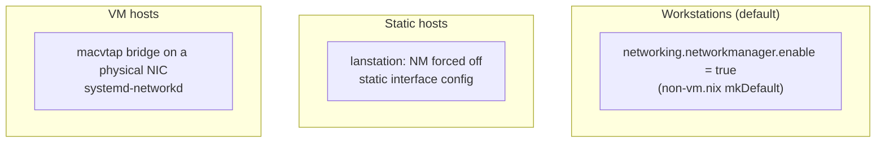
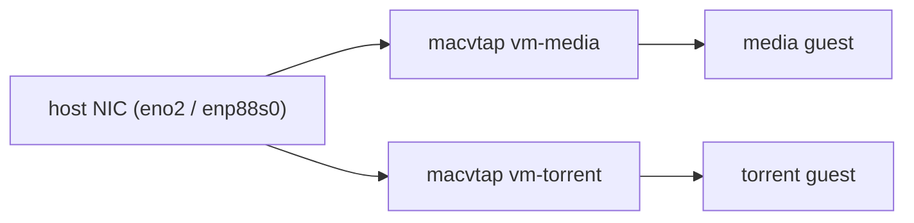

# Networking

This page collects the fleet's addressing plan and the networking mechanisms used across hosts and MicroVM guests.

---

## Address plan

The primary LAN is **`10.10.10.0/26`** (prefix length `26` in `settings.nix`). Static assignments live in `cala-m-os.ip` — see [[Global Settings|Global-Settings]] for the full table.

| Address | Host/role |
|---------|-----------|
| `10.10.10.1` | gateway |
| `10.10.10.10` | media (Plex) guest |
| `10.10.10.15` | homelab |
| `10.10.10.30` | battlestation |
| `10.10.10.35` | torrent guest |
| `10.10.10.40` | htpc |
| `10.10.10.41`–`44` | lanstation NICs / gaming VMs |
| `10.10.10.45` | vault guest |

A separate **`10.1.10.0/24`** segment is used by the `livedata` guests (`openreturn` `10.1.10.41`, `quorumcall` `10.1.10.42`, gateway `10.1.10.1`) via per-guest `ipOverride`/`gatewayOverride`/`dns`.

---

## Host networking models

- **Default workstation:** NetworkManager on (`non-vm.nix`, `mkDefault`). WiFi credentials come from agenix `.nmconnection` secrets in `modules/wifi`. See [[Secrets & Security|Secrets-and-Security]].
- **`lanstation`:** forces `networking.networkmanager.enable = lib.mkForce false` and uses static interface config across its NICs (`10.10.10.41`–`44`).
- **VM hosts:** use systemd-networkd with macvtap bridges (below).
- **Firewall:** `networking.firewall.enable = true` in `_core`; modules open the ports they need (e.g. `cala-caddy` opens 80/443; tailscale trusts `tailscale0`).

---

## MicroVM macvtap networking

Each guest attaches a `macvtap` interface (bridge mode) to the VM host's `networkInterface`, so guests appear as first-class devices on the LAN. Managed by [[`cala-vm-manager`|MicroVMs]].

- **MAC derivation:** explicit `mac` → from a static IP's last octet (`02:00:00:00:00:<octet>`) → hashed from the guest name.
- **Static IP:** systemd-networkd matches the MAC, sets `address`, a default route via the gateway (`GatewayOnLink = true`), and DNS (`dns` or gateway).
- **DHCP:** used when no static IP is resolvable.
- The host adds a `<network-name>-noip` rule (`network-name = "10-macvtap"`) marking `vm-*` links unmanaged so the host itself doesn't try to address them, plus a `19-docker` `veth*` unmanaged rule inside guests.

---

## Reverse proxy & TLS

`cala-caddy` fronts services with TLS; `cala-certs` issues a `*.calamooselabs.com` wildcard via Cloudflare DNS-01. Guests that serve behind Caddy get the cert over a virtiofs `acmecerts` share. See [[Services|Services]].

---

## VPN & mesh

- **`tailscale`** — mesh VPN; firewall trusts `tailscale0`; auth key from agenix.
- **`vpn` / `proton-vpn`** — NetworkManager VPN connections from agenix `.nmconnection` secrets.
- **torrent guest** — qBittorrent runs behind a WireGuard (ProtonVPN) tunnel; the WG config arrives via virtiofs at `/run/hostsecrets/proton-vpn.conf`.
- **`bridge-internet`** module — dnsmasq + nftables NAT/DHCP for sharing a connection.

---

## Quick reference

| Concern | Where |
|---------|-------|
| Static IP table | `settings.nix` → `cala-m-os.ip` |
| Subnet prefix | `settings.nix` → `networking.prefixLength` ("26") |
| macvtap network name | `settings.nix` → `networking.network-name` ("10-macvtap") |
| WiFi/VPN credentials | `modules/wifi`, `modules/vpn` (agenix) |
| Per-guest networking | `vms.<name>.{ipOverride,gatewayOverride,dns,mac}` |
| Firewall base | `hosts/_core/configuration.nix` |
