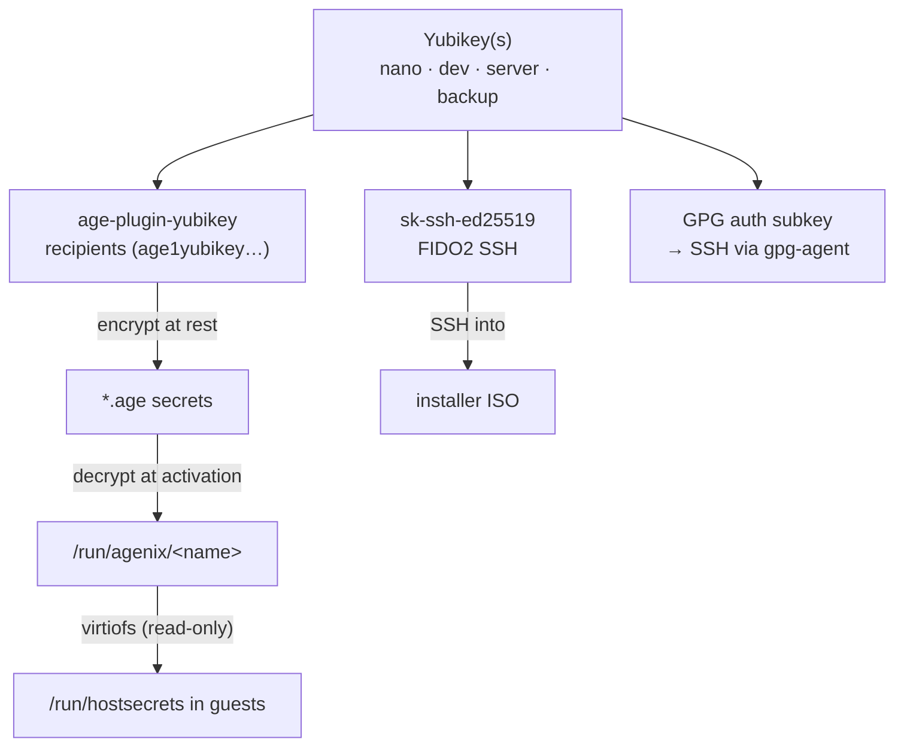

# Secrets & Security

Hardware **Yubikeys are the single root of trust**. The same physical keys provide (a) age recipients for secret encryption, (b) FIDO2 SSH keys for logging into the installer, and (c) GPG-agent-backed SSH for normal use. Secrets are managed with [agenix](https://github.com/ryantm/agenix).



---

## agenix wiring

`modules/agenix/configuration.nix` imports the agenix module and, when secrets are enabled, installs `agenix`/`age`/`age-plugin-yubikey` and configures identities:

```nix
age = lib.mkIf config.calamoose.enableSecrets {
  identityPaths = [
    "${./.}/identities/server.key"
    "${./.}/identities/yubi.key"
    "${./.}/identities/dev.key"
    "${./.}/identities/backup.key"
  ];
  ageBin = "PATH=$PATH:${lib.makeBinPath [pkgs.age-plugin-yubikey]} ${pkgs.age}/bin/age";
};
```

The identity files are `age-plugin-yubikey` **stubs** (not secret) — they point at a recipient; the private key lives on the Yubikey. PIN and touch policies are **Never**, so decryption needs the physical key present but no interaction — enabling unattended boot-time decryption.

### The four recipients

| Identity file | Role | In which secrets |
|---------------|------|------------------|
| `yubi.key` (nano) | Always-present nano key | **every** secret |
| `backup.key` | Backup key | **every** secret |
| `dev.key` | Dev workstation | dev/workstation secrets |
| `server.key` | Server | server/host secrets |

### Where the recipient map lives

There is **no single repo-wide `secrets.nix`**. Each secret bundle co-locates its own `secrets.nix` (the recipient list agenix reads when editing/encrypting) with a sibling `default.nix` that registers the secret into `age.secrets`. To edit:

```bash
agenix -e <file>.age -i ./identities/yubi.key   # run from the bundle dir
```

### Decryption target

agenix decrypts to `/run/agenix/<name>`; consumers read `config.age.secrets.<name>.path`. The agenix activation is ordered **after `basic.target`** (so impermanence bind-mounts land first) and depends on `pcscd` (smartcard daemon) to reach the Yubikey.

---

## The `calamoose.enableSecrets` gate

Declared in `hosts/_core/options.nix` (default `true`). Every secret-consuming block is wrapped in `lib.mkIf config.calamoose.enableSecrets`, so flipping it to `false` skips all secret registration, the agenix install, and the VM secret share.

**Hosts with `enableSecrets = false`:** `broadcast`, `openreturn`, `quorumcall`, `livedata`. These build without needing a decryptable Yubikey present.

---

## Secret inventory

| Secret (`.age`) | Bundle | Consumed by |
|-----------------|--------|-------------|
| `admin_password` | `users/_core/secrets/` | `users.users.*.hashedPasswordFile` |
| `work_credentials` | `users/debugger/secrets/` | CIFS mount `/mnt/nkc` |
| `proton_vpn.conf` | `users/debugger/secrets/` | debugger VPN |
| `yubigpg.asc` | `modules/gpg/secrets/` | GPG public key / owner-trust restore |
| `tailscale-preauth-key` | `modules/tailscale/secrets/` | `tailscale up --authkey` |
| `CalamooseWiFi` / `CalamooseLabs` / `NKCWiFi` / `theisenair` / `NETGEAR43` `.nmconnection` | `modules/wifi/secrets/` | NetworkManager system connections |
| `CasaMosVPN` / `NKCGateway` `.nmconnection` | `modules/vpn/secrets/` | NetworkManager VPN connections |
| `cloudflare-token` | `hosts/homelab/secrets/` | `cala-certs` DNS-01 token |
| `qbit-password` | `hosts/homelab/secrets/` | torrent VM (via virtiofs → `/run/hostsecrets`) |
| `proton-vpn.conf` | `hosts/homelab/secrets/` | torrent VM WireGuard (via virtiofs) |

---

## Yubikey & GPG modules

**`modules/yubikey/`** — system: `services.pcscd.enable = true` (PC/SC smartcard daemon). home: installs `yubioath-flutter` (OATH GUI). No `pam-u2f` is configured.

**`modules/gpg/`** — system: `programs.gpg` with scdaemon `card-timeout=1`, `disable-ccid=true` (use the pcscd PC/SC path). home: `gpg-agent` with `enableSSHSupport = true` (the Yubikey's GPG auth subkey **is** the SSH agent) and `pinentry-curses`. Imports the `yubigpg.asc` secret.

---

## Secrets into MicroVM guests

Guests stay **keyless**. The host decrypts to `/run/agenix` (host Yubikey present at host boot), then `cala-vm-manager` shares that directory read-only into each guest over virtiofs (only when `enableSecrets`):

```nix
shares = lib.optionals config.calamoose.enableSecrets [
  { proto = "virtiofs"; tag = "agenix"; source = "/run/agenix"; mountPoint = "/run/hostsecrets"; }
] ++ vm.shares ++ …;
```

So a guest reads plaintext from `/run/hostsecrets/<name>`. Confirmed in the torrent guest:

```nix
wireguardConfigFile     = "/run/hostsecrets/proton-vpn.conf";
qbittorrentPasswordFile = "/run/hostsecrets/qbit-password";
```

(`homelab` decrypts those `hosts/homelab/secrets/` items and shares them down.) See [[MicroVMs|MicroVMs]].

---

## Installer SSH (FIDO2)

The ISO forces sshd up and authorizes the two `sk-ssh-ed25519` (Yubikey-resident FIDO2) public keys in `iso/public_keys/`, with `pcscd` enabled in the live env — so you can SSH into the live installer using only the Yubikey. See [[ISO & Installer|ISO-Installer]].

---

## Summary

Encrypt to 2–4 Yubikey recipients (nano + backup always; dev/server where relevant) → decrypt at activation into `/run/agenix` → gate everything on `calamoose.enableSecrets` → fan out to guests over read-only virtiofs at `/run/hostsecrets`. SSH and GPG ride the same hardware keys.
