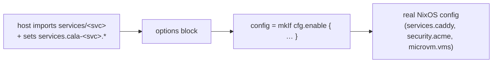

# Services

`services/` holds the heavier infrastructure pieces — the ones that warrant being written the idiomatic NixOS way: real modules with an `options` block and a `config = lib.mkIf cfg.enable {…}` body, configured declaratively by hosts. They live under the **`services.cala-*`** namespace (prefixed `cala-` to avoid colliding with upstream options like `services.caddy`).



There are three: **`cala-caddy`**, **`cala-certs`**, **`cala-vm-manager`**.

---

## `cala-caddy` — reverse proxy

`services/caddy/` wraps upstream `services.caddy` with project TLS defaults.

**Options** (`services.cala-caddy`):

| Option | Type | Default | Purpose |
|--------|------|---------|---------|
| `enable` | bool | false | Turn the proxy on |
| `reverseProxies` | attrsOf str | `{}` | `domain → upstream` map |
| `tlsCert` | str | `/mnt/acme/cert.pem` | Cert served for all vhosts |
| `tlsKey` | str | `/mnt/acme/key.pem` | Key served for all vhosts |

**Behavior:** builds `services.caddy.virtualHosts` from `reverseProxies` (each vhost does `tls <cert> <key>` + `reverse_proxy <target>`), opens TCP 80/443, and hardens the systemd unit (`Restart=on-failure`, `AmbientCapabilities=CAP_NET_BIND_SERVICE`).

**Usage** (`hosts/torrent/configuration.nix`):

```nix
imports = [ … ../../services/caddy ];

services.cala-caddy = {
  enable = true;
  reverseProxies = {
    "radarr.${cala-m-os.fqdn}"   = "localhost:7878";
    "sonarr.${cala-m-os.fqdn}"   = "localhost:8989";
    "prowlarr.${cala-m-os.fqdn}" = "localhost:9696";
    "qbit.${cala-m-os.fqdn}"     = "10.200.200.2:8080";
  };
};
```

---

## `cala-certs` — ACME wildcard certs

`services/certs/` issues a wildcard cert via Cloudflare DNS-01 and hardens DNS so propagation checks work.

**Options** (`services.cala-certs`):

| Option | Type | Purpose |
|--------|------|---------|
| `enable` | bool | Turn it on |
| `domain` | str | Base domain (a `*.domain` wildcard is also issued) |
| `tokenPath` | str | Path to the Cloudflare API token env file (an agenix secret) |

**Behavior:** disables DNS caching (`services.resolved` with `Cache=no`, forces `nscd` off, NM DNS `none`), then `security.acme` requests `<domain>` + `*.<domain>` via the `cloudflare` provider, email from `cala-m-os.globals.defaultEmail`, cert group `caddy`. Also enables upstream `services.caddy` (so the `caddy` group exists for the cert).

**Usage** (`hosts/lab/vms.nix`):

```nix
services.cala-certs = {
  enable = true;
  domain = cala-m-os.fqdn;
  tokenPath = config.age.secrets.cloudflare-token.path;
};
```

---

## `cala-vm-manager` — MicroVM host management

`services/vm-manager/` turns a declarative `vms` set into MicroVM guests. This one has the most depth — full treatment in [[MicroVMs|MicroVMs]]; here's the service shape.

**Options** (`services.cala-vm-manager`):

| Option | Type | Purpose |
|--------|------|---------|
| `enable` | bool | Turn it on |
| `devicePath` | path | Directory of per-device `host.nix`/`guest.nix` passthrough modules |
| `networkInterface` | str | Host NIC the guests' macvtap bridges attach to |
| `vms` | attrsOf (submodule) | The guests, keyed by name (typed submodule: `storage`, `devices`, `shares`, `autostart`, `ipOverride`, …) |

**The one constraint that shapes its usage:** NixOS forbids `imports` from depending on `config`. The per-device **host** passthrough files must be top-level imports, but they're derived from the `vms` set. So they're split into a tiny static helper:

```nix
# hosts/<vmhost>/vms.nix
imports =
  [ ../../services/vm-manager ]
  ++ (import ../../services/vm-manager/host-imports.nix {
       devicePath = ./devices; inherit vms; });

services.cala-vm-manager = {
  enable = true;
  devicePath = ./devices;
  networkInterface = "eno2";
  inherit vms;
};
```

`host-imports.nix` is a pure function `{devicePath, vms} → [ device host.nix paths ]`. Everything else (the `microvm.vms` config, guest networking) flows through the `config = mkIf cfg.enable` block. The microvm host module is imported statically inside the service module.

---

## Why this pattern

Before, these were function-imports: `(import ../../services/x/default.nix { args })`. Converting them to `options` + `mkIf` modules means:

- Hosts read declaratively (`services.cala-caddy.enable = true`) — consistent with the rest of NixOS and with the project's own `calamoose.enableSecrets` option.
- Option types validate inputs (e.g. the `vms` submodule rejects a malformed guest).
- Defaults live in one place.

A service module is imported only by the hosts that use it, so its options exist exactly where needed.
