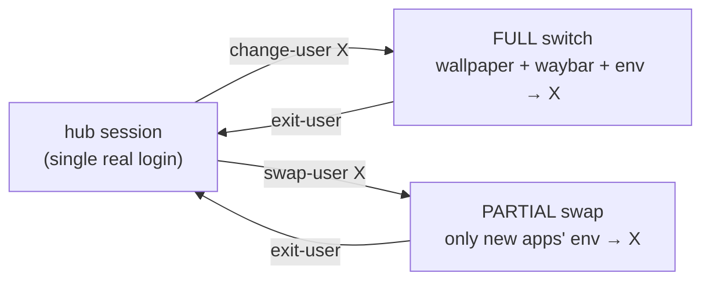
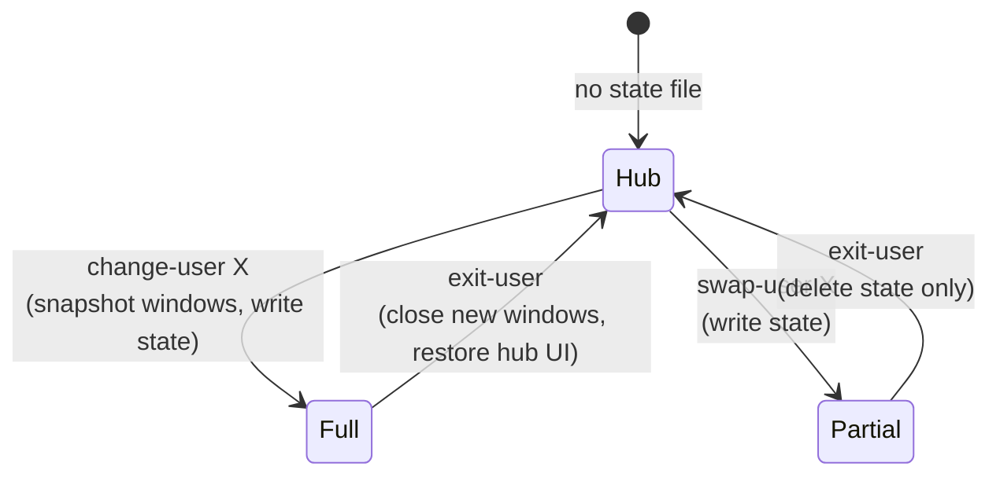

# User Switching (Personas)

On a multi-user host, a single logged-in **`hub`** session can adopt another user's environment live — no logout, no re-login. This is the "persona" system, implemented in `modules/user-switching/`.

> **Activation:** the feature turns on automatically when a host's `users_list` has 2+ profiles (the host layer prepends `hub` and sets `userSwitching.enable = true` with `switchableUsers = users_list`). No flake-wired host triggers it today, but the machinery is complete. See [[Configuration Hierarchy|Configuration-Hierarchy]].

---

## The idea



There is **no real `su`**. Switching just repoints `HOME` and the XDG base dirs at another user's home directory. A shared `personas` Unix group + `homeMode = "770"` on each persona home is what makes those directories mutually readable/writable, so `hub` can launch apps as if it were the persona without elevating.

---

## What gets configured when enabled

```nix
users.groups.personas = {};
users.users = lib.mkMerge [
  { "hub".extraGroups = ["personas"]; }
  (lib.genAttrs cfg.switchableUsers (_: { extraGroups = ["personas"]; homeMode = "770"; }))
];
environment.systemPackages = [ exit-user pkgs.jq ];          # system-wide
home-manager.users.hub.home.packages = [ change-user swap-user rofi-persona ];  # hub only
```

- A shared `personas` group; `hub` + every switchable persona join it.
- Each persona home is `770` (group rwx) → cross-readable within `personas`.
- **Asymmetric tooling:** `exit-user` + `jq` are system-wide (any persona can escape back to hub); `change-user`, `swap-user`, `rofi-persona` go only into hub's packages (only hub initiates).
- `rofi-persona` and `persona-status` are installed **unconditionally** (even on non-switching hosts) so the Hyprland keybind and waybar config never break — they just fall back to plain behavior.

---

## State file

A single flat file at `/run/user/$UID/hub-switch` (tmpfs, volatile). Its existence means "a switch is active."

| Line | Contents |
|------|----------|
| 1 | target username |
| 2 | mode — `full` or `partial` |
| 3 | (full only) space-separated pre-switch Hyprland window addresses |



---

## The commands

### `change-user <user>` — full switch
1. Refuse if a switch is already active or the target doesn't exist.
2. **Snapshot** current Hyprland window addresses (`hyprctl clients -j | jq`) → line 3.
3. Write state in `full` mode.
4. Reload wallpaper from the target's hyprpaper config.
5. Restart waybar with `HOME`/`XDG_CONFIG_HOME` pointed at the target → the bar adopts the persona's theme.

Everything still runs under hub's UID; only `HOME`/XDG are redirected.

### `swap-user <user>` — partial swap
Writes state in `partial` mode and nothing else. No visible UI change. The effect is lazy: apps launched afterward (via `rofi-persona`) inherit the persona's environment, while waybar/wallpaper stay hub's. No window snapshot (exit closes nothing).

### `exit-user` — revert
1. No-op if no state file.
2. **Full mode:** diff current Hyprland windows against the snapshot and **close every window opened during the switch** (`hyprctl dispatch closewindow`), restore hub's wallpaper, restart waybar with hub's env.
3. **Partial mode:** just delete the state file (persona apps keep running; env injection stops).
4. Remove the state file.

---

## The supporting pieces

### `rofi-persona` — the launcher that injects the persona
The heart of both modes. If a switch is active, rofi (and everything launched from it) inherits the persona's `HOME` + all XDG base dirs; otherwise it's plain `rofi -show drun`:

```sh
if [ -f "$STATE" ]; then
  TARGET=$(sed -n '1p' "$STATE")
  exec env HOME="/home/$TARGET" \
           XDG_CONFIG_HOME="/home/$TARGET/.config" \
           XDG_DATA_HOME="/home/$TARGET/.local/share" \
           XDG_CACHE_HOME="/home/$TARGET/.cache" \
           rofi -show drun
else
  exec rofi -show drun
fi
```

### `persona-status` — waybar source
Prints `[<target>]` **only during a full switch** (silent during partial), so the bar reflects exactly the visible state.

### `loadHyprpaper` helper
A shared bash function used by `change-user`/`exit-user` to swap the desktop wallpaper: unloads all, parses a hyprpaper config (`preload =` / `wallpaper =`, expanding `~`), and replays via `hyprctl hyprpaper`.

---

## Hyprland + Waybar integration

- **Hyprland keybind** (`modules/hyprland/home.nix`): `$mod, space → pkill rofi || rofi-persona`. Super+Space always routes through the persona-aware launcher.
- **Waybar** (`modules/waybar/home.nix`): reads `osConfig.userSwitching.enable`. When true it prepends a `custom/persona` module:

```nix
"custom/persona" = {
  exec = "persona-status";
  interval = 2;
  on-click = "exit-user";     # click the indicator → return to hub
  format = "{}";
  tooltip = false;
};
```

On non-switching hosts the module is omitted entirely.

---

## Why this design

Because the [[system vs home split|Users-and-Profiles]] builds each persona's home tree independently, switching needs no rebuild and no real session change — just environment redirection backed by the `personas` group permissions. Full switches additionally swap the *visible* shell (wallpaper + bar) and track windows so exit can clean up precisely; partial swaps are invisible and only affect newly launched apps.
