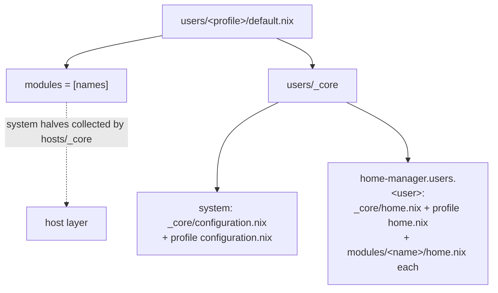

# Users & Profiles

A **user profile** is a directory under `users/` that declares which [[modules|Modules]] a user gets plus any user-level settings. Profiles are resolved into both system-level and home-manager config by the `users/_core` engine.

> **Profile name ≠ username.** The primary profile on a host is mapped to the system username `hub`; other profiles use their directory name. See [[Configuration Hierarchy|Configuration-Hierarchy]] for the host-side detection logic.

---

## Profile inventory

**Active profiles** (have a real `default.nix`):

| Profile | Role |
|---------|------|
| `_core` | Shared profile machinery (not a user) |
| `hub` | The always-present switcher / session user; thinnest interactive profile |
| `basic` | Lightweight desktop persona |
| `debugger` | The most comprehensive (~55 modules); used by `devbox` |
| `gamer`, `gamer-vm` | Gaming personas (the latter for VM guests) |
| `mixer` | A/V persona (`battlestation`) |
| `server` | Headless server persona (`lab`, `livedata`, `openreturn`) |
| `streamer` | OBS/streaming persona (`studio`) |
| `void` | Minimal persona (`ephemeral`) |

**Stub placeholders** (only `.gitkeep`): `creator`, `developer`, `switcher`, `writer`.

A profile directory may contain: `default.nix` (entry), `configuration.nix` (system-level user specifics), `home.nix` (home overrides), `secrets/` (agenix), `public_keys/` (SSH), and occasionally extras like `routes.nix`.

---

## The `default.nix` convention

Every profile follows the same shape:

```nix
{isDefaultUser, ...}: let
  uuid = baseNameOf (toString ./.);          # directory name = identifier

  modules = [ "agenix" "bash" "git" "neovim" "openssh" "yubikey" ];   # bare names
in {
  inherit modules;                            # exposed so the host can collect system imports

  module = {cala-m-os, ...}: let
    username = if isDefaultUser
               then cala-m-os.globals.defaultUser   # "hub"
               else uuid;
  in {
    imports = [
      (import ../_core {
        username = username;
        import_modules = modules;
        uuid = uuid;
      })
    ];
  };
}
```

Key points:
- **`uuid`** = the directory name (`baseNameOf ./.`). Doubles as the username when not the default user.
- **`modules`** = a flat list of **strings**. Each resolves to `modules/<name>/`.
- The profile returns `{ modules; module; }`:
  - `modules` lets the **host layer** collect every module's system-level `configuration.nix`.
  - `module` wires the home-manager side by importing `users/_core`.
- **`isDefaultUser`** decides the username: `hub` if primary, else the directory name.

Profiles with their own secrets (e.g. `debugger`) also `import ./secrets` inside `module`.

---

## The `users/_core` resolver

`users/_core/default.nix` turns module name-strings into actual imports:

```nix
home_imports = map (name: import (modules_path + "/${name}/home.nix")) import_modules;
in {
  imports = [
    ./secrets
    (import ./configuration.nix { inherit username; })          # core user (system)
    (import "${user_config_path}/configuration.nix" { inherit username; })  # profile system
  ];

  home-manager.users.${username} = {
    imports = [
      (import ./home.nix { inherit username user_home_path; })   # core home
      (import "${user_config_path}/home.nix" { inherit username; })  # profile home
    ] ++ home_imports;                                            # one per module
  };
}
```



**Critical asymmetry:** `users/_core` resolves only the **home.nix** half of the named modules. The modules' **system `configuration.nix`** halves are imported one level up, by `hosts/_core/configuration.nix` (deduped across all profiles). This split is deliberate — system config is machine-global; home config is per-persona.

### The core user files

`users/_core/configuration.nix` — every user is a normal user, password from agenix when secrets are on:

```nix
users.users.${username} = {
  isNormalUser = true;
  hashedPasswordFile =
    lib.mkIf config.calamoose.enableSecrets config.age.secrets.admin_password.path;
};
```

`users/_core/home.nix` — sets `home.username` and `home.homeDirectory` (default `/home/<username>`).

---

## Per-profile `configuration.nix` (system specifics)

This is where a profile adds groups, sudo, mounts, and host-network rules. Examples:

- **`hub`** — groups `wheel networkmanager personas`, NOPASSWD sudo, orders agenix after `basic.target`.
- **`server`** — groups incl. `libvirtd kvm disk plugdev`, SSH `authorizedKeys.keyFiles` from `./public_keys/`.
- **`debugger`** — hardware groups (`scanner lp input dialout render video`), NFS mount `/mnt/backups`, CIFS mount `/mnt/nkc` (creds from agenix `work_credentials`), opens TCP 8080/8000.

## Per-profile `home.nix`

Per-persona home overrides layered on top of the module home files. `hub/home.nix` is essentially empty (thin session user); `debugger/home.nix` adds `usbutils`/`pciutils` and an EasyEffects preset.

---

## System vs home, summarized

| Layer | File | Resolved by | Scope |
|-------|------|-------------|-------|
| System | `modules/<n>/configuration.nix` | `hosts/_core` (union, deduped) | Machine-global |
| Home | `modules/<n>/home.nix` | `users/_core` (per profile) | Per-persona home |

This separation is exactly what makes [[persona switching|User-Switching]] work: the system layer (accounts, groups, the switch scripts) is built once, while each persona's home tree is materialized independently — so switching is just repointing `HOME`/XDG at an already-built home.

---

## Adding a user

1. `nix flake init -t .#user` (or copy an existing profile dir).
2. Set the `modules` list in `users/<name>/default.nix`.
3. Add `<name>` to a host's `users_list` (or a second entry to enable [[switching|User-Switching]]).
4. Add a `configuration.nix` for any groups/mounts; `home.nix` for home overrides.
5. Rebuild. Recipe in [[Common Tasks|Common-Tasks]].
